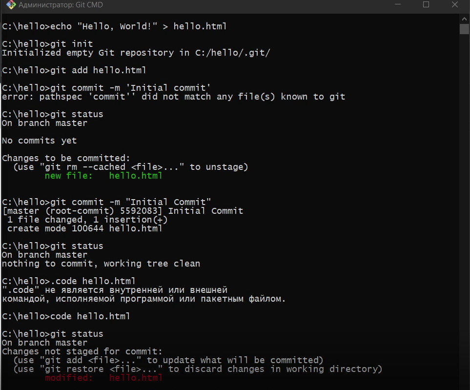
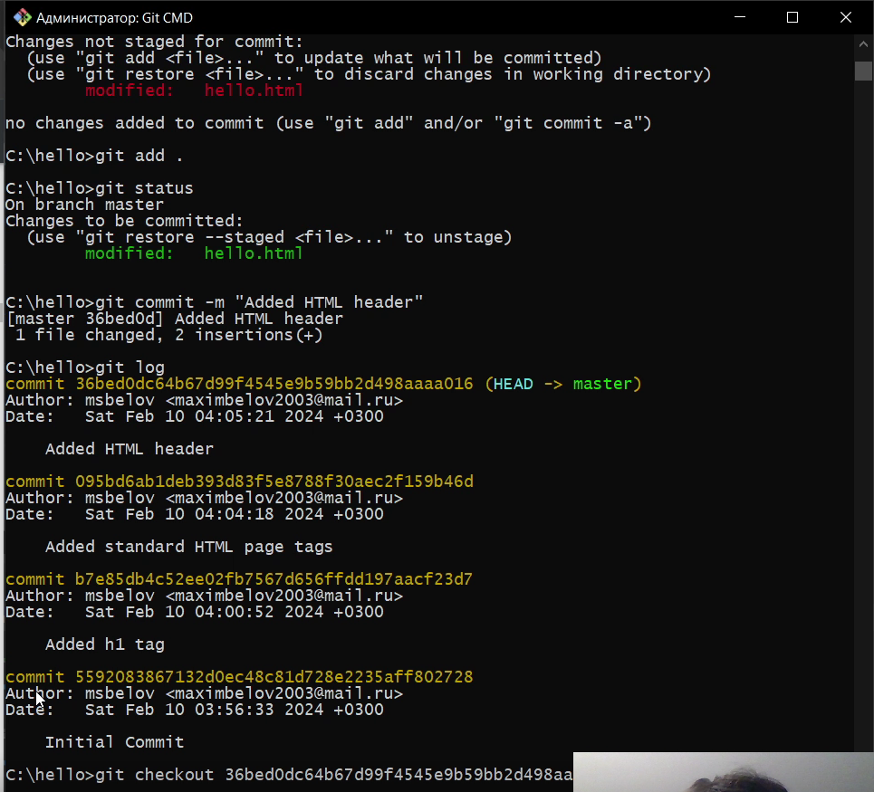
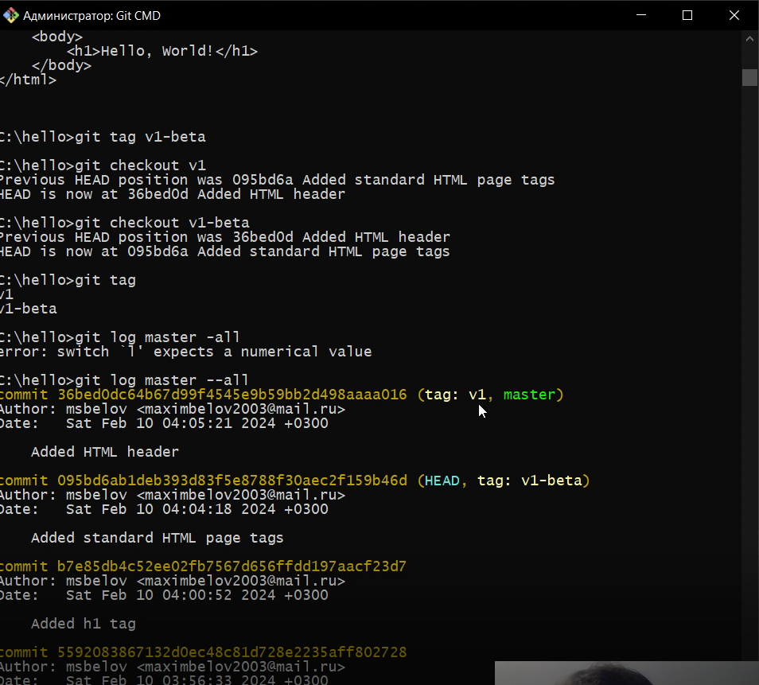
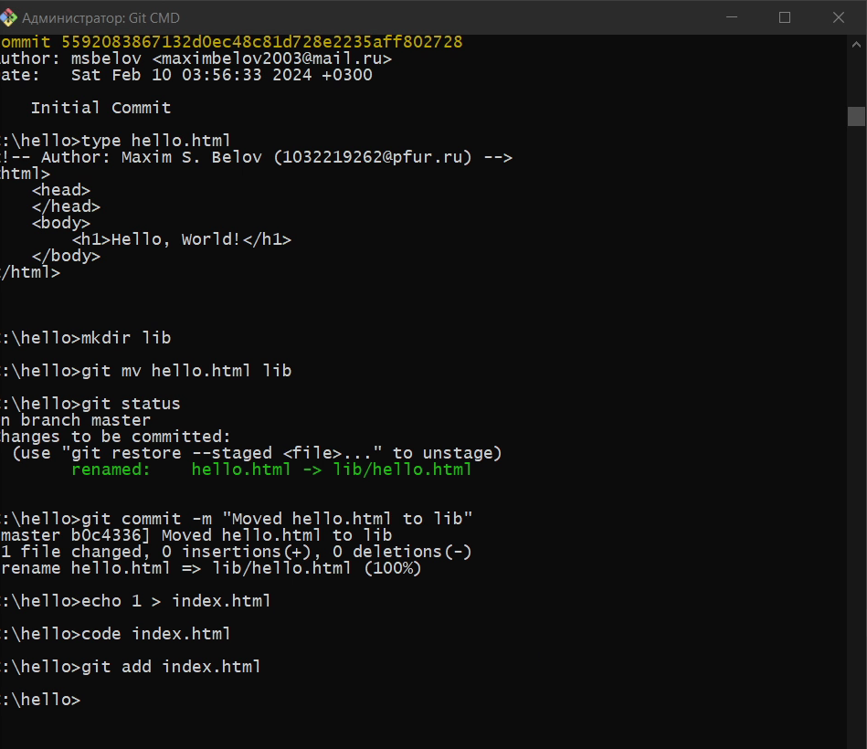
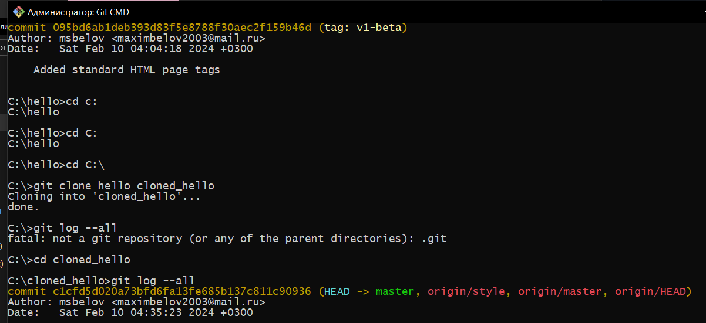
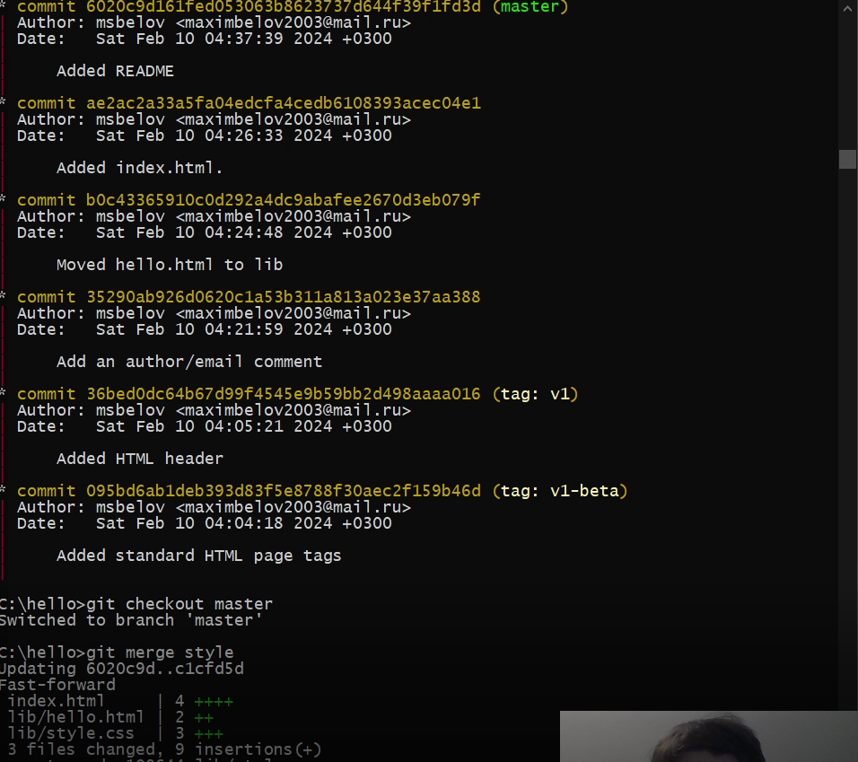

---
## Front matter
lang: ru-RU
title: Лабораторная работа №1
subtitle: Работа с Git
author:
  - Белов Максим Сергеевич
institute:
  - Российский университет дружбы народов, Москва, Россия
date: 09 февраля 2024

## i18n babel
babel-lang: russian
babel-otherlangs: english
mainfont: Arial
monofont: Courier New
fontsize: 12pt

## Formatting pdf
toc: false
toc-title: Содержание
slide_level: 2
aspectratio: 169
section-titles: true
theme: metropolis
header-includes:
 - \metroset{progressbar=frametitle,sectionpage=progressbar,numbering=fraction}
 - '\makeatletter'
 - '\beamer@ignorenonframefalse'
 - '\makeatother'
---

# Цель работы

Вспомнить работу с системой контроля версий git.

# Выполнение лабораторной работы

Создадим файл с именем hello.html.

{ #fig:001 width=70% }

##

Добавим в hello.html различные теги, добавим в репозиторий и закоммитим изменения.

{ #fig:002 width=70% }

##

{ #fig:003 width=70% }

##

Попытаемся создать структуру нашего репозитория. Давайте перенесем
страницу в каталог lib.

{ #fig:004 width=70% }

##

Создадим клон репозитория. В нашем рабочем каталоге теперь должно быть два репозитория: оригинальный репозиторий и клонированный.

{ #fig:005 width=70% }

##

Научимся извлекать изменения из общего репозитория.

{ #fig:006 width=70% }

# Вывод

В ходе работы я вспомнил основные принципы работы с системой контроля версий git.

