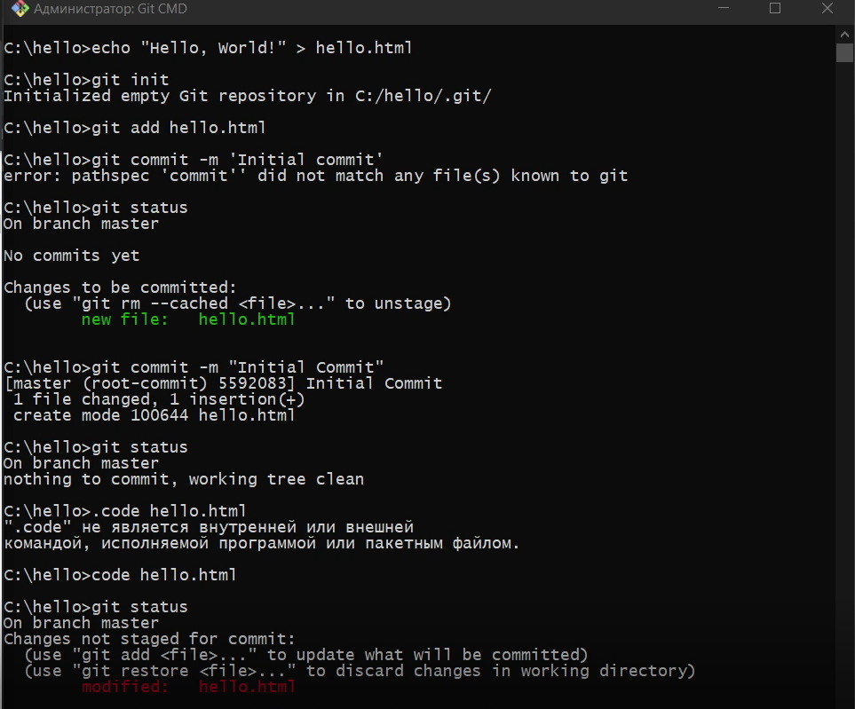
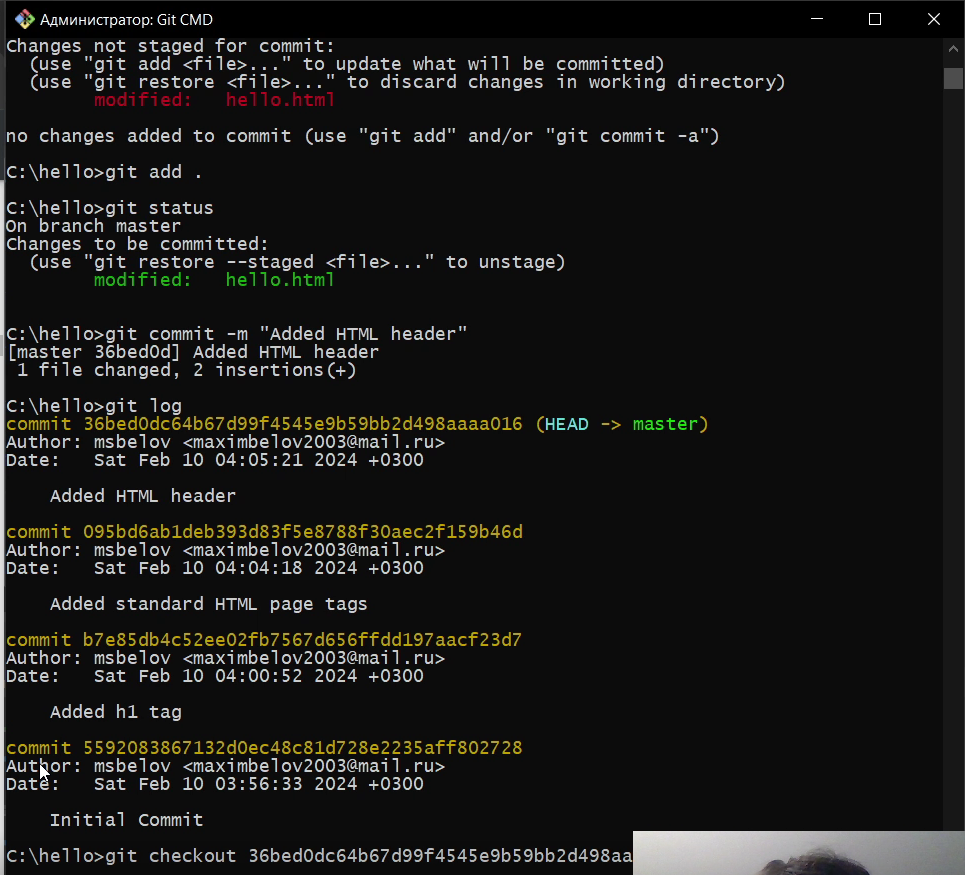
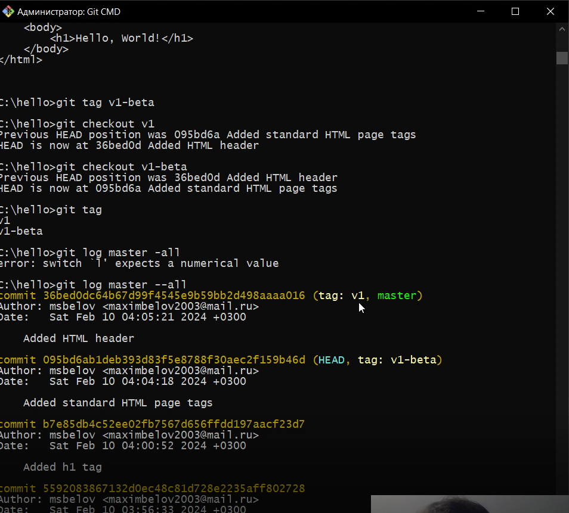
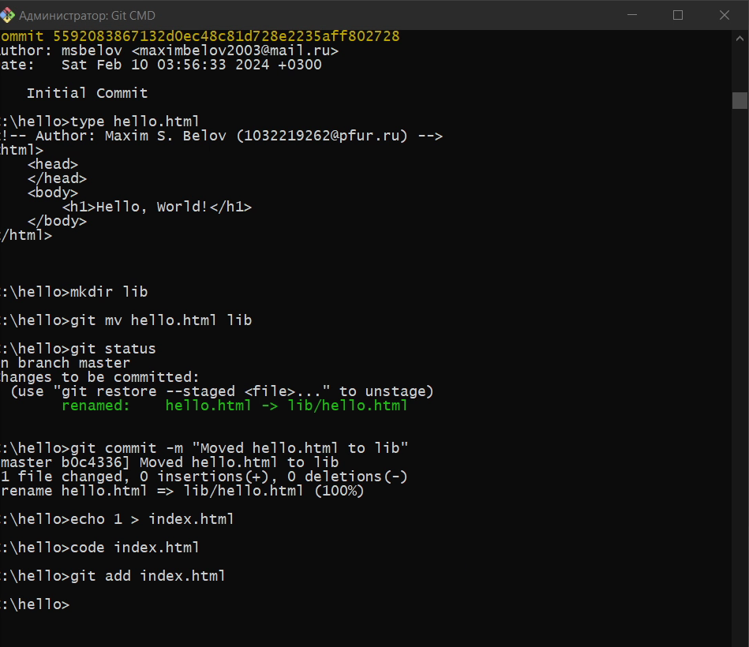
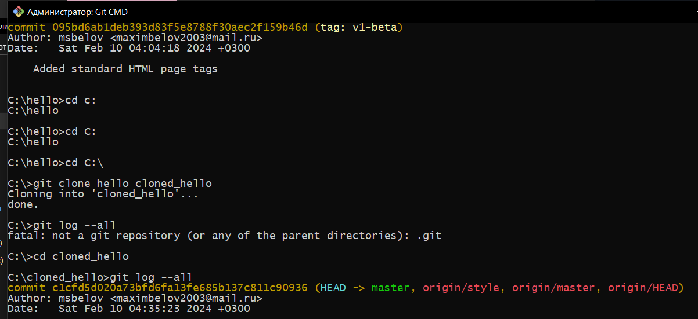
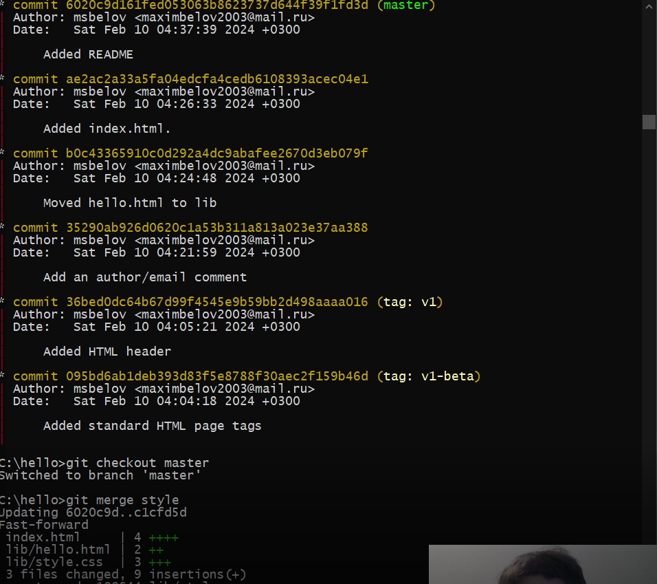

---
## Front matter
title: "Лабораторная работа №1"
subtitle: "Работа с Git"
author: "Белов Максим Сергеевич, НПИбд-01-21"

## Generic otions
lang: ru-RU
toc-title: "Содержание"

## Bibliography
bibliography: bib/cite.bib
csl: pandoc/csl/gost-r-7-0-5-2008-numeric.csl

## Pdf output format
toc: true # Table of contents
toc-depth: 2
lof: true # List of figures
fontsize: 12pt
linestretch: 1.5
papersize: a4
documentclass: scrreprt
## I18n polyglossia
polyglossia-lang:
  name: russian
  options:
	- spelling=modern
	- babelshorthands=true
polyglossia-otherlangs:
  name: english
## I18n babel
babel-lang: russian
babel-otherlangs: english
## Fonts
mainfont: PT Serif
romanfont: PT Serif
sansfont: PT Sans
monofont: PT Mono
mainfontoptions: Ligatures=TeX
romanfontoptions: Ligatures=TeX
sansfontoptions: Ligatures=TeX,Scale=MatchLowercase
monofontoptions: Scale=MatchLowercase,Scale=0.9
## Biblatex
biblatex: true
biblio-style: "gost-numeric"
biblatexoptions:
  - parentracker=true
  - backend=biber
  - hyperref=auto
  - language=auto
  - autolang=other*
  - citestyle=gost-numeric

## Pandoc-crossref LaTeX customization
figureTitle: "Рис."
tableTitle: "Таблица"
listingTitle: "Листинг"
lofTitle: "Список иллюстраций"
lotTitle: "Список таблиц"
lolTitle: "Листинги"
## Misc options
indent: true
header-includes:
  - \usepackage{indentfirst}
  - \usepackage{float} # keep figures where there are in the text
  - \floatplacement{figure}{H} # keep figures where there are in the text
---

# Цель работы

Вспомнить работу с системой контроля версий git.

# Задание

Провести различные действия с репозиторием с помощью git.

# Теоретическое введение

## Git

Git — это специальная программа, которая позволяет отслеживать любые изменения в файлах, хранить их версии и оперативно возвращаться в любое сохранённое состояние.

# Выполнение лабораторной работы

### Создание hello.html

Начнем работу в пустом рабочем каталоге с создания пустого каталога с именем hello, затем войдем в него и создадим там файл с именем hello.html.
Чтобы создать git репозиторий из этого каталога, выполним команду git init. Добавим файл в репозиторий.
(Рис. [-@fig:001])

{ #fig:001 width=70% }

### git log

Добавим в hello.html различные теги, добавим в репозиторий и закоммитим изменения. С помощью git log можем просмотреть список произведенных изменений. (Рис. [-@fig:002])

{ #fig:002 width=70% }

### Создание тегов версий

Назовем текущую версию страницы hello первой (v1). Также создадим тег для версии, которая идет перед текущей версией и назовем его v1-beta. Мы можем увидеть, какие теги доступны, используя команду git tag. Также можем посмотреть теги в логе с помощью git log master --all. (Рис. [-@fig:003])

{ #fig:003 width=70% }

### Перемещение файлов

Попытаемся создать структуру нашего репозитория. Давайте перенесем
страницу в каталог lib. Перемещая файлы с помощью git mv, мы информируем git о 2 вещах:
- Что файл hello.html был удален.
- Что файл lib/hello.html был создан.
- Оба эти факта сразу же проиндексированы и готовы к коммиту. Команда git
status сообщает, что файл был перемещен. (Рис. [-@fig:004])

{ #fig:004 width=70% }

### Клон репозитория hello

Создадим клон репозитория. В нашем рабочем каталоге теперь должно быть два репозитория: оригинальный репозиторий «hello» и клонированный репозиторий «cloned_hello». Если взглянуть на содержание cloned_hellp мы увидим список всех файлов на верхнем уровне оригинального репозитория README.md, index.html и lib. (Рис. [-@fig:005])

{ #fig:005 width=70% }

### Извлечение общих изменений

Научимся извлекать изменения из общего репозитория. Быстро переключимся в
клонированный репозиторий и извлечем изменения, только что отправленные в
общий репозиторий. (Рис. [-@fig:006])

{ #fig:006 width=70% }

# Вывод

В ходе работы я вспомнил основные принципы работы с системой контроля версий git.

