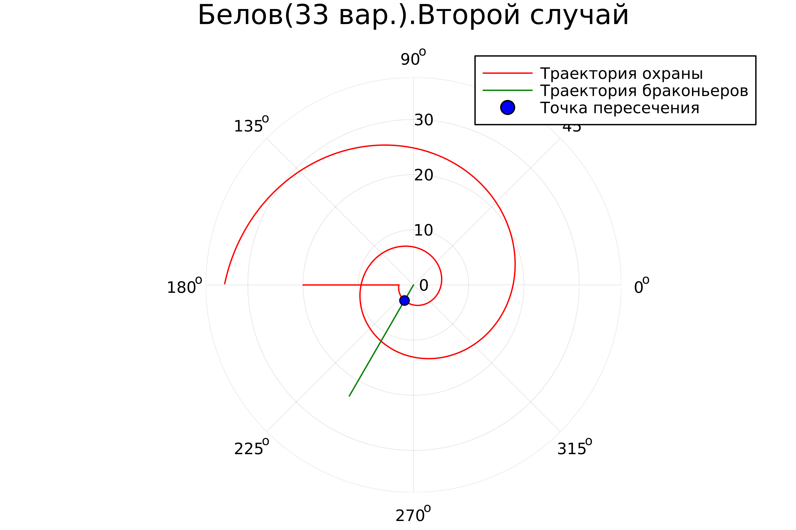

---
## Front matter
lang: ru-RU
title: Лабораторная работа №2
subtitle: Задача о погоне
author:
  - Белов М.С
institute:
  - Российский университет дружбы народов, Москва, Россия
date: 16 января 2024

## i18n babel
babel-lang: russian
babel-otherlangs: english
mainfont: Arial
monofont: Courier New
fontsize: 12pt

## Formatting pdf
toc: false
toc-title: Содержание
slide_level: 2
aspectratio: 169
section-titles: true
theme: metropolis
header-includes:
 - \metroset{progressbar=frametitle,sectionpage=progressbar,numbering=fraction}
 - '\makeatletter'
 - '\beamer@ignorenonframefalse'
 - '\makeatother'
---

# Задача

33 вариант ((1032219262 % 70) + 1)

На море в тумане катер береговой охраны преследует лодку браконьеров.
Через определенный промежуток времени туман рассеивается, и лодка
обнаруживается на расстоянии 20 км от катера. Затем лодка снова скрывается в
тумане и уходит прямолинейно в неизвестном направлении. Известно, что скорость
катера в 5 раза больше скорости браконьерской лодки.
Необходимо определить по какой траектории необходимо двигаться катеру,
чтоб нагнать лодку

# Выполнение лабораторной работы

## Рассуждения

1. Траектория катера должна быть такой, чтобы и катер, и лодка все время
были на одном расстоянии от полюса $\theta$
, только в этом случае траектория
катера пересечется с траекторией лодки.
Поэтому для начала катер береговой охраны должен двигаться некоторое
время прямолинейно, пока не окажется на том же расстоянии от полюса, что
и лодка браконьеров. После этого катер береговой охраны должен двигаться
вокруг полюса удаляясь от него с той же скоростью, что и лодка
браконьеров.

##

2. Чтобы найти расстояние
$x$ (расстояние после которого катер начнет
двигаться вокруг полюса), необходимо составить простое уравнение. Пусть
через время $t$ катер и лодка окажутся на одном расстоянии $x$
от полюса. За это время лодка пройдет $x$, а катер $20 + x$ (или $20 - x$, в зависимости от начального положения катера относительно полюса). Время, за которое они пройдут это расстояние, вычисляется как $x / v$ или (${20 - x})/{5v}$, ((${20 + x})/{5v}$). Так как время одно и то же, то эти величины одинаковы. Тогда неизвестное расстояние $x$ можно найти из следующего уравнения:

##

$$ \left[ \begin{array}{cl}
{{x}/{v}} = {({20 - x})/{5v}}\\
{{x}/{v}} = {({20 + x})/{5v}}
\end{array} \right. $$

Отсюда мы найдем два значения $x_1=10/3$, $x_2=5$.

##

3. После того, как катер береговой охраны окажется на одном расстоянии от
полюса, что и лодка, он должен сменить прямолинейную траекторию и
начать двигаться вокруг полюса удаляясь от него со скоростью лодки. Для этого скорость катера раскладываем на две составляющие: радиальная скорость и тангенциальная скорость. (Рис. 1)

{ #fig:001 width=70% }

Из рисунка видно: 
$$ v_\tau = {{\sqrt{24}v}} $$

##

4. Решение исходной задачи сводится к решению системы из двух
дифференциальных уравнений:

$$ \left\{ \begin{array}{cl}
{dr/ dt} = v \\
r{d\theta/ dt} = {{\sqrt{24}v}}
\end{array} \right. $$

##

с начальными условиями 

$$ \left\{ \begin{array}{cl}
\theta_0 = 0 \\
r_0 = {{10}/{3}}
\end{array} \right. $$

или

$$ \left\{ \begin{array}{cl}
\theta_0 = -\pi \\
r_0 = {5}
\end{array} \right. $$

##

Исключая из полученной системы производную по t, можно перейти к следующему уравнению:

$$ {dr/ d\theta} = {r/\sqrt{24}} $$

## Моделирование на Julia

Первый случай:

{ #fig:002 width=70% }

##

Второй случай:

{ #fig:003 width=70% }

# Вывод

В ходе работы я рассмотрел один из примеров построения математических моделей для выбора правильной стратегии при решении задач поиска.
