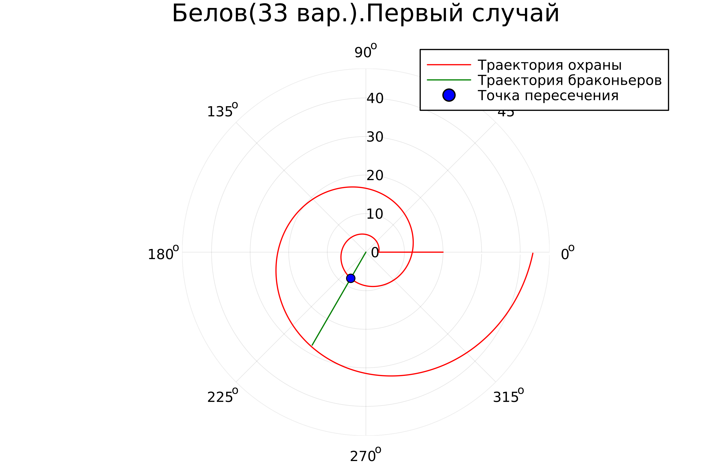
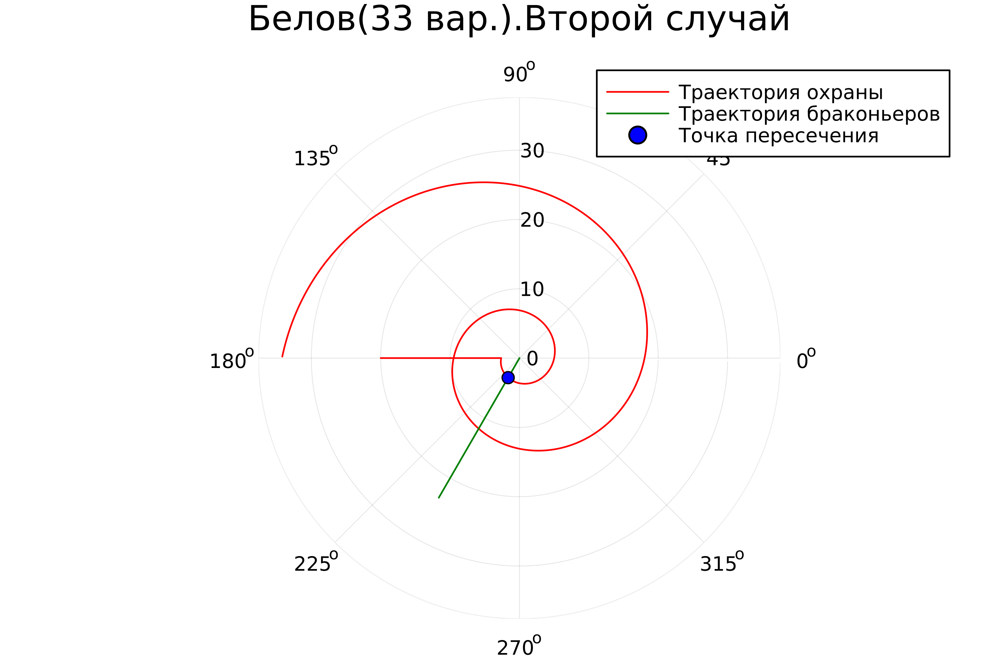

---
## Front matter
title: "Лабораторная работа №2"
subtitle: "Задача о погоне"
author: "Белов Максим Сергеевич, НПИбд-01-21"

## Generic otions
lang: ru-RU
toc-title: "Содержание"

## Bibliography
bibliography: bib/cite.bib
csl: pandoc/csl/gost-r-7-0-5-2008-numeric.csl

## Pdf output format
toc: true # Table of contents
toc-depth: 2
lof: true # List of figures
fontsize: 12pt
linestretch: 1.5
papersize: a4
documentclass: scrreprt
## I18n polyglossia
polyglossia-lang:
  name: russian
  options:
	- spelling=modern
	- babelshorthands=true
polyglossia-otherlangs:
  name: english
## I18n babel
babel-lang: russian
babel-otherlangs: english
## Fonts
mainfont: PT Serif
romanfont: PT Serif
sansfont: PT Sans
monofont: PT Mono
mainfontoptions: Ligatures=TeX
romanfontoptions: Ligatures=TeX
sansfontoptions: Ligatures=TeX,Scale=MatchLowercase
monofontoptions: Scale=MatchLowercase,Scale=0.9
## Biblatex
biblatex: true
biblio-style: "gost-numeric"
biblatexoptions:
  - parentracker=true
  - backend=biber
  - hyperref=auto
  - language=auto
  - autolang=other*
  - citestyle=gost-numeric

## Pandoc-crossref LaTeX customization
figureTitle: "Рис."
tableTitle: "Таблица"
listingTitle: "Листинг"
lofTitle: "Список иллюстраций"
lotTitle: "Список таблиц"
lolTitle: "Листинги"
## Misc options
indent: true
header-includes:
  - \usepackage{indentfirst}
  - \usepackage{float} # keep figures where there are in the text
  - \floatplacement{figure}{H} # keep figures where there are in the text
---

# Цель работы

Моделирование задачи о погоне.

# Задание

33 вариант ((1032219262 % 70) + 1)

На море в тумане катер береговой охраны преследует лодку браконьеров.
Через определенный промежуток времени туман рассеивается, и лодка
обнаруживается на расстоянии 20 км от катера. Затем лодка снова скрывается в
тумане и уходит прямолинейно в неизвестном направлении. Известно, что скорость
катера в 5 раза больше скорости браконьерской лодки.
Необходимо определить по какой траектории необходимо двигаться катеру,
чтоб нагнать лодку

# Теоретическое введение

## Кривая погони

Кривая погони — кривая, представляющая собой решение задачи о «погоне», которая ставится следующим образом. Пусть точка 
A равномерно движется по некоторой заданной кривой. Требуется найти траекторию равномерного движения точки 
P такую, что касательная, проведённая к траектории в любой момент движения, проходила бы через соответствующее этому моменту положение точки 
A.

# Выполнение лабораторной работы

### Рассуждения

1. Траектория катера должна быть такой, чтобы и катер, и лодка все время
были на одном расстоянии от полюса $\theta$
, только в этом случае траектория
катера пересечется с траекторией лодки.
Поэтому для начала катер береговой охраны должен двигаться некоторое
время прямолинейно, пока не окажется на том же расстоянии от полюса, что
и лодка браконьеров. После этого катер береговой охраны должен двигаться
вокруг полюса удаляясь от него с той же скоростью, что и лодка
браконьеров.

2. Чтобы найти расстояние
$x$ (расстояние после которого катер начнет
двигаться вокруг полюса), необходимо составить простое уравнение. Пусть
через время $t$ катер и лодка окажутся на одном расстоянии $x$
от полюса. За это время лодка пройдет $x$, а катер $20 + x$ (или $20 - x$, в зависимости от начального положения катера относительно полюса). Время, за которое они пройдут это расстояние, вычисляется как $x / v$ или (${20 - x})/{5v}$, ((${20 + x})/{5v}$). Так как время одно и то же, то эти величины одинаковы. Тогда неизвестное расстояние $x$ можно найти из следующего уравнения:

$$ \left[ \begin{array}{cl}
{{x}/{v}} = {({20 - x})/{5v}}\\
{{x}/{v}} = {({20 + x})/{5v}}
\end{array} \right. $$

Отсюда мы найдем два значения $x_1=10/3$, $x_2=5$.

3. После того, как катер береговой охраны окажется на одном расстоянии от
полюса, что и лодка, он должен сменить прямолинейную траекторию и
начать двигаться вокруг полюса удаляясь от него со скоростью лодки. Для этого скорость катера раскладываем на две составляющие: радиальная скорость и тангенциальная скорость. (Рис. 1)

{ #fig:001 width=70% }

Из рисунка видно: 
$$ v_\tau = {{\sqrt{24}v}} $$

4. Решение исходной задачи сводится к решению системы из двух
дифференциальных уравнений:

$$ \left\{ \begin{array}{cl}
{dr/ dt} = v \\
r{d\theta/ dt} = {{\sqrt{24}v}}
\end{array} \right. $$

с начальными условиями 

$$ \left\{ \begin{array}{cl}
\theta_0 = 0 \\
r_0 = {{10}/{3}}
\end{array} \right. $$

или

$$ \left\{ \begin{array}{cl}
\theta_0 = -\pi \\
r_0 = {5}
\end{array} \right. $$

Исключая из полученной системы производную по t, можно перейти к следующему уравнению:

$$ {dr/ d\theta} = {r/\sqrt{24}} $$

### Моделирование на Julia

Исходный код:

```
using Plots

const distance = 20
const diff = 5
const thetaPrayDeg = 240
const dTheta = 0.01
const maxTheta = 4π

# Первый случай

r0 = distance / (diff + 1)
theta0 = 0 

theta1 = theta0 + maxTheta
thetaHunt = theta0:dTheta:theta1
thetaPray = thetaPrayDeg * π / 180 + 2 * theta0


plt_first = plot(proj=:polar, aspect_ratio=:equal, dpi=500, title="Белов(33 вар.).Первый случай", legend=true)
plot!(plt_first, [theta0, theta0], [distance, r0 * exp(theta0 / sqrt(diff^2 - 1))], label=false, color=:red)
plot!(plt_first, thetaHunt, theta -> r0 * exp(theta / sqrt(diff^2 - 1)), label=:"Траектория охраны", color=:red)
plot!(plt_first, [0, thetaPray], [0, r0 * exp(thetaPray / sqrt(diff^2 - 1)) + 20], label=:"Траектория браконьеров", color=:green)
plot!(plt_first, [thetaPray], [r0 * exp(thetaPray / sqrt(diff^2 - 1))], seriestype=:scatter, label=:"Точка пересечения", color=:blue)

savefig(plt_first, "lab2_1.png")

# Второй случай
r0 = distance / (diff - 1)
theta0 = -π

theta1 = theta0 + maxTheta
thetaHunt = theta0:dTheta:theta1
thetaPray = thetaPrayDeg * π / 180 + 2 * theta0


plt_second = plot(proj=:polar, aspect_ratio=:equal, dpi=500, title="Белов(33 вар.).Второй случай", legend=true)
plot!(plt_second, [theta0, theta0], [distance, r0 * exp(theta0 / sqrt(diff^2 - 1))], label=false, color=:red)
plot!(plt_second, thetaHunt, theta -> r0 * exp(theta / sqrt(diff^2 - 1)), label=:"Траектория охраны", color=:red)
plot!(plt_second, [0, thetaPray], [0, r0 * exp(thetaPray / sqrt(diff^2 - 1)) + 20], label=:"Траектория браконьеров", color=:green)
plot!(plt_second, [thetaPray], [r0 * exp(thetaPray / sqrt(diff^2 - 1))], seriestype=:scatter, label=:"Точка пересечения", color=:blue)

savefig(plt_second, "lab2_2.png")
```

Первый случай:

{ #fig:002 width=70% }

Второй случай:

{ #fig:003 width=70% }


# Вывод

В ходе работы я рассмотрел один из примеров построения математических моделей для выбора правильной стратегии при решении задач поиска.

