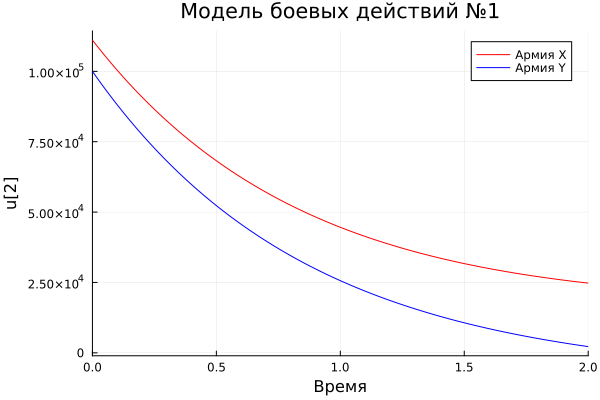

---
## Front matter
lang: ru-RU
title: Лабораторная работа №3
subtitle: Модель боевых действий
author:
  - Белов М.С
institute:
  - Российский университет дружбы народов, Москва, Россия
date: 19 февраля 2024

## i18n babel
babel-lang: russian
babel-otherlangs: english
mainfont: Arial
monofont: Courier New
fontsize: 12pt

## Formatting pdf
toc: false
toc-title: Содержание
slide_level: 2
aspectratio: 169
section-titles: true
theme: metropolis
header-includes:
 - \metroset{progressbar=frametitle,sectionpage=progressbar,numbering=fraction}
 - '\makeatletter'
 - '\beamer@ignorenonframefalse'
 - '\makeatother'
---

# Задача

33 вариант ((1032219262 % 70) + 1)

Между страной $X$ и страной $Y$ идет война. Численность состава войск
исчисляется от начала войны, и являются временными функциями $x(t)$
и $y(t)$. В начальный момент времени страна $Х$ имеет армию численностью 111 111 человек,а в распоряжении страны $У$ армия численностью в 99 999 человек. Для упрощения модели считаем, что коэффициенты $a, b, c, h$
постоянны. Также считаем $P(t)$ и $Q(t)$ непрерывные функции.

## Задача

Постройте графики изменения численности войск армии Х и армии У для
следующих случаев:

1. Модель боевых действий между регулярными войсками - 
$a = 0.33,
b = 0.77,
c = 0.44,
h = 0.66,
P(t) = sin(t+11),
Q(t) = cos(t+11)$

2. Модель ведение боевых действий с участием регулярных войск и
партизанских отрядов - 
$a = 0.33,
b = 0.77,
c = 0.22,
h = 0.88,
P(t) = sin(22*t),
Q(t) = cos(22*t)$

# Выполнение лабораторной работы

## Моделирование на Julia

- 1. Модель боевых действий между регулярными войсками

Получившийся график:

{ #fig:001 width=70% }

Как видно из графика армия $X$ выигрывает у армии $Y$, так как численность армии $Y=0$ в то время, как численность армии $X$ положительно.

## Моделирование на Julia

- 2. Модель ведение боевых действий с участием регулярных войск и
партизанских отрядов

Получившийся график:

{ #fig:002 width=70% }

## Моделирование на OpenModelica
- 1. Модель боевых действий между регулярными войсками

График:

{ #fig:003 width=70% }

## Моделирование на OpenModelica

- 2. Модель ведение боевых действий с участием регулярных войск и
партизанских отрядов

График:

{ #fig:004 width=70% }

# Вывод

В ходе работы я рассмотрел один из примеров построения математических моделей боевых действий.
