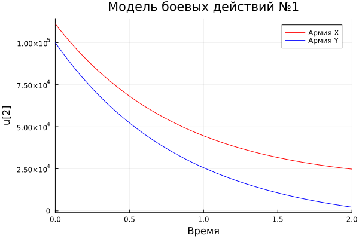
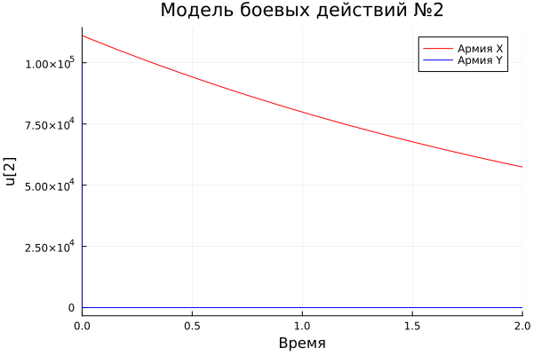
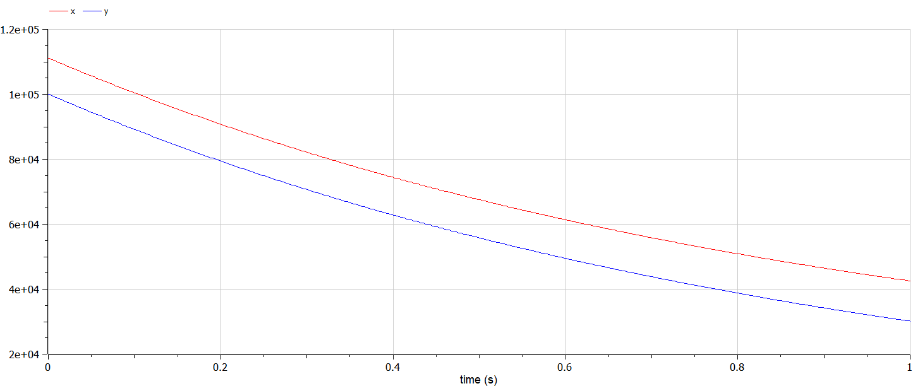
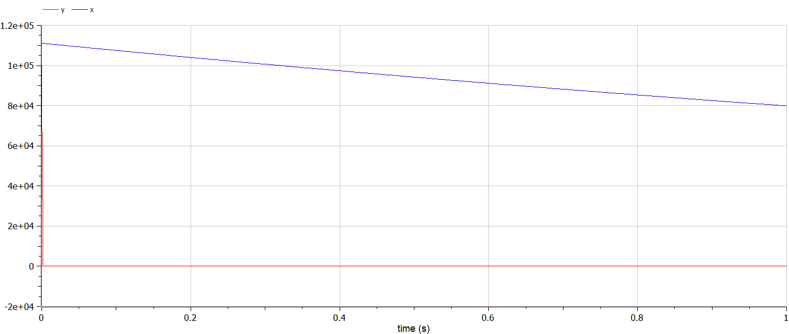

---
## Front matter
title: "Лабораторная работа №3"
subtitle: "Модель боевых действий"
author: "Белов Максим Сергеевич, НПИбд-01-21"

## Generic otions
lang: ru-RU
toc-title: "Содержание"

## Bibliography
bibliography: bib/cite.bib
csl: pandoc/csl/gost-r-7-0-5-2008-numeric.csl

## Pdf output format
toc: true # Table of contents
toc-depth: 2
lof: true # List of figures
fontsize: 12pt
linestretch: 1.5
papersize: a4
documentclass: scrreprt
## I18n polyglossia
polyglossia-lang:
  name: russian
  options:
	- spelling=modern
	- babelshorthands=true
polyglossia-otherlangs:
  name: english
## I18n babel
babel-lang: russian
babel-otherlangs: english
## Fonts
mainfont: PT Serif
romanfont: PT Serif
sansfont: PT Sans
monofont: PT Mono
mainfontoptions: Ligatures=TeX
romanfontoptions: Ligatures=TeX
sansfontoptions: Ligatures=TeX,Scale=MatchLowercase
monofontoptions: Scale=MatchLowercase,Scale=0.9
## Biblatex
biblatex: true
biblio-style: "gost-numeric"
biblatexoptions:
  - parentracker=true
  - backend=biber
  - hyperref=auto
  - language=auto
  - autolang=other*
  - citestyle=gost-numeric

## Pandoc-crossref LaTeX customization
figureTitle: "Рис."
tableTitle: "Таблица"
listingTitle: "Листинг"
lofTitle: "Список иллюстраций"
lotTitle: "Список таблиц"
lolTitle: "Листинги"
## Misc options
indent: true
header-includes:
  - \usepackage{indentfirst}
  - \usepackage{float} # keep figures where there are in the text
  - \floatplacement{figure}{H} # keep figures where there are in the text
---

# Цель работы

Рассмотрение и моделирование моделей Ланчестера

# Задание

33 вариант ((1032219262 % 70) + 1)

Между страной $Х$ и страной $У$ идет война. Численность состава войск
исчисляется от начала войны, и являются временными функциями $x(t)$
и $y(t)$. В начальный момент времени страна $Х$ имеет армию численностью 111 111 человек,а в распоряжении страны $У$ армия численностью в 99 999 человек. Для упрощения модели считаем, что коэффициенты $a, b, c, h$
постоянны. Также считаем $P(t)$ и $Q(t)$ непрерывные функции.

Постройте графики изменения численности войск армии Х и армии У для
следующих случаев:

1. Модель боевых действий между регулярными войсками - 
$a = 0.33,
b = 0.77,
c = 0.44,
h = 0.66,
P(t) = sin(t+11),
Q(t) = cos(t+11)$

2. Модель ведение боевых действий с участием регулярных войск и
партизанских отрядов - 
$a = 0.33,
b = 0.77,
c = 0.22,
h = 0.88,
P(t) = sin(22*t),
Q(t) = cos(22*t)$


# Теоретическое введение

## Законы Ланчестера

Законы Ланчестера (законы Осипова — Ланчестера) — математическая формула для расчета относительных сил пары сражающихся сторон — подразделений вооруженных сил.

В 1916 году, в разгар первой мировой войны, Фредерик Ланчестер разработал систему дифференциальных уравнений для демонстрации соотношения между противостоящими силами. Среди них есть так называемые Линейные законы Ланчестера (первого рода или честного боя, для рукопашного боя или неприцельного огня) и Квадратичные законы Ланчестера (для войн начиная с XX века с применением прицельного огня, дальнобойных орудий, огнестрельного оружия).

# Выполнение лабораторной работы

### Моделирование на Julia

- 1. Модель боевых действий между регулярными войсками

Исходный код:

``` Julia
using Plots
using DifferentialEquations

x0 = 111111
y0 = 99999

a = 0.33
b = 0.77
c = 0.44
h = 0.66

P(t) = sin(t+11)
Q(t) = cos(t+11)

u0 = [x0, y0]
p = (a, b, c, h)
T = [0, 2]

function F(du, u, p, t)
    a, b, c, h = p
    du[1] = -a * u[1] - b * u[2] + P(t) 
    du[2] = -c * u[1] - b * u[2] + Q(t)
end

prob = ODEProblem(F, u0, T, p)

sol = solve(prob)

plt = plot!(
     sol,
      vars=(0,1),
      color=:red,
      label="Армия X",
      title="Модель боевых действий №1"
     )
plot!(
      sol,
      vars=(0,2),
      color=:blue,
     label="Армия Y",
     xlabel="Время")

savefig(plt, "lab3_1.png")
```

Получившийся график:

{ #fig:001 width=70% }

Как видно из графика армия $X$ выигрывает у армии $Y$, так как численность армии $Y=0$ в то время, как численность армии $X$ положительно.

- 2. Модель ведение боевых действий с участием регулярных войск и
партизанских отрядов

Исходный код:

``` Julia
using Plots
using DifferentialEquations

x0 = 111111
y0 = 99999

a = 0.33
b = 0.77
c = 0.22
h = 0.88

P(t) = sin(22*t)
Q(t) = cos(22*t)

u0 = [x0, y0]
p = (a, b, c, h)
T = [0, 2]

function F(du, u, p, t)
    a, b, c, h = p
    du[1] = -a * u[1] - b * u[2] + P(t) 
    du[2] = -c * u[1] * u[2] - b * u[2] + Q(t)
end

prob = ODEProblem(F, u0, T, p)

sol = solve(prob)

plt = plot!(
     sol,
      vars=(0,1),
      color=:red,
      label="Армия X",
      title="Модель боевых действий №2"
     )
plot!(
      sol,
      vars=(0,2),
      color=:blue,
     label="Армия Y",
     xlabel="Время")

savefig(plt, "lab3_2.png")
```
Получившийся график:

{ #fig:002 width=70% }

### Моделирование на OpenModelica
- 1. Модель боевых действий между регулярными войсками

Исходный код:
```OpenModelica
model lab3_1
parameter Integer x0 = 111111;
parameter Integer y0 = 99999;
parameter Real a = 0.33;
parameter Real b = 0.77;
parameter Real c = 0.44;
parameter Real h = 0.66;
Real P;
Real Q;
Real x(start=x0);
Real y(start=y0);
equation
P = sin(time+11);
Q = cos(time+11);
der(x) = - a * x - b * y + P;
der(y) = - c * x - h * y + Q;
end lab3_1;
```
График:

{ #fig:003 width=70% }

- 2. Модель ведение боевых действий с участием регулярных войск и
партизанских отрядов

Исходный код:

``` OpenModelica
model lab3_2
parameter Integer x0 = 111111;
parameter Integer y0 = 99999;
parameter Real a = 0.33;
parameter Real b = 0.77;
parameter Real c = 0.22;
parameter Real h = 0.88;
Real P;
Real Q;
Real x(start=x0);
Real y(start=y0);
equation
P = sin(22*time);
Q = cos(22*time);
der(x) = - a * x - b * y + P;
der(y) = - c * x * y - h * y + Q;
end lab3_2;
```
График:

{ #fig:004 width=70% }

# Вывод

В ходе работы я рассмотрел один из примеров построения математических моделей боевых действий.

