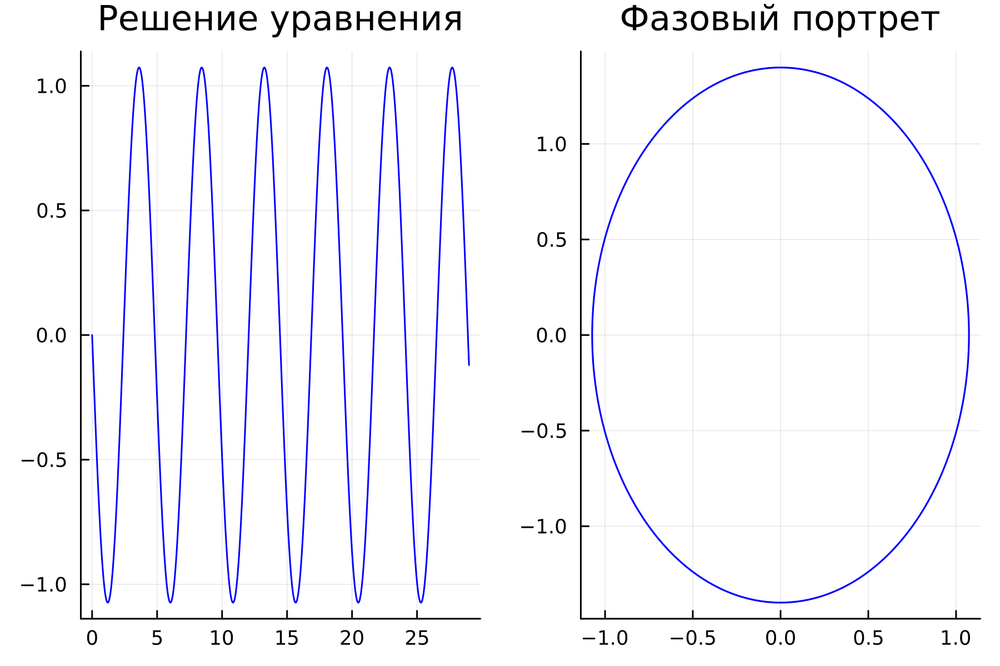
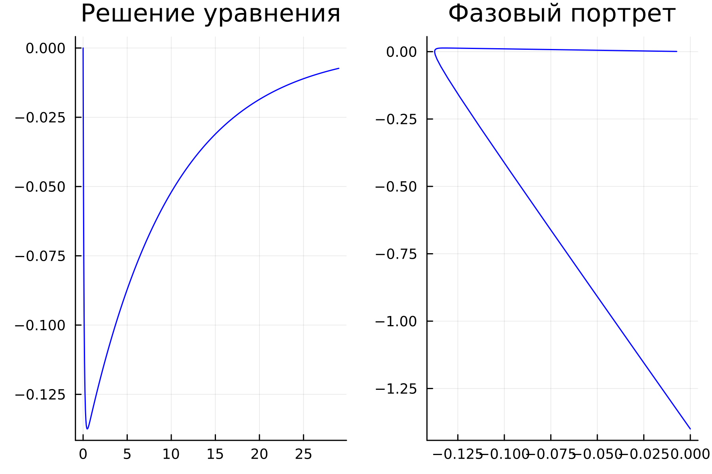
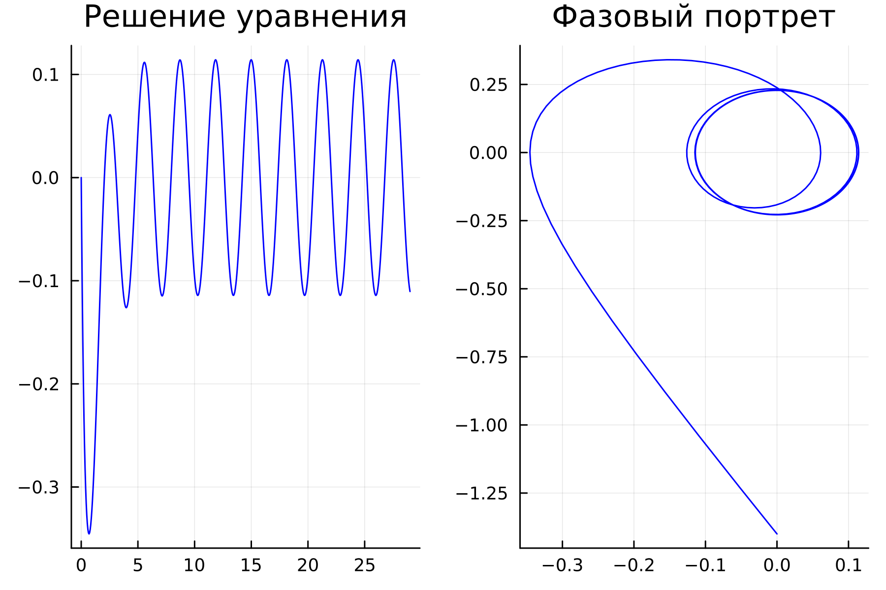
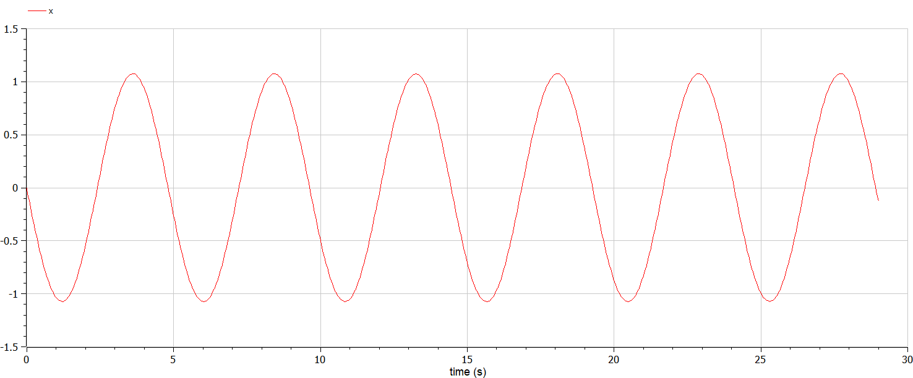
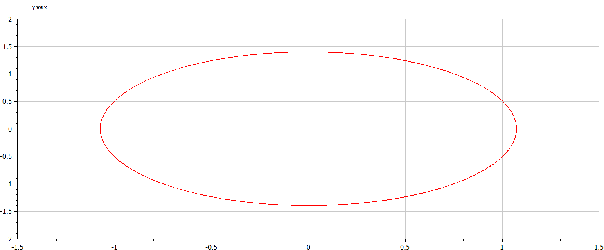
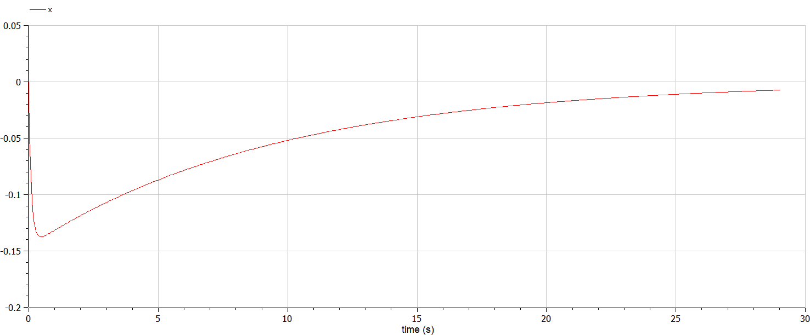
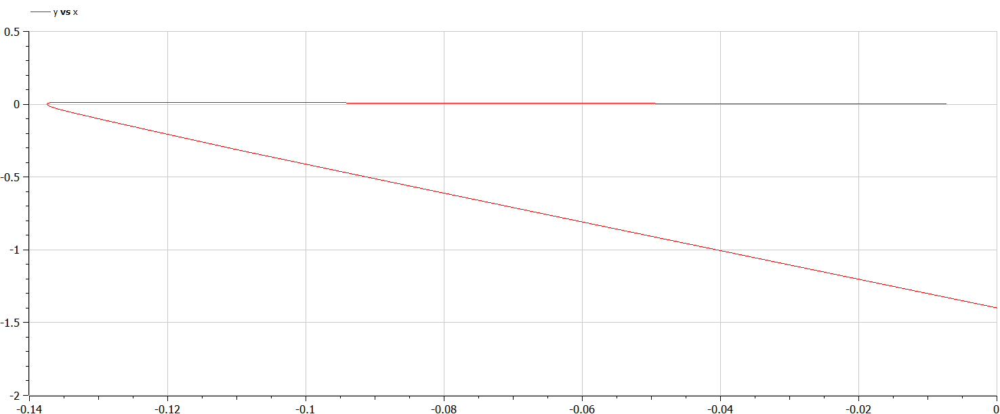
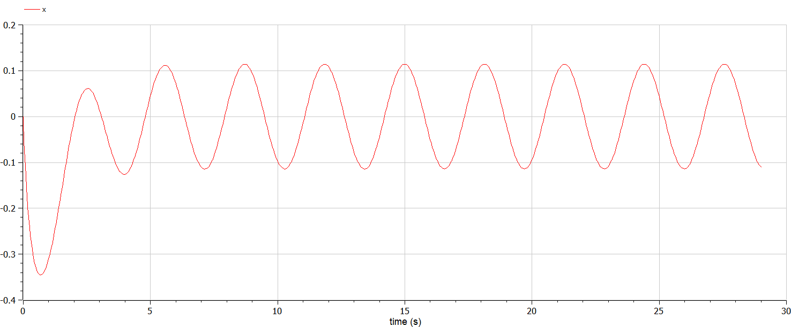
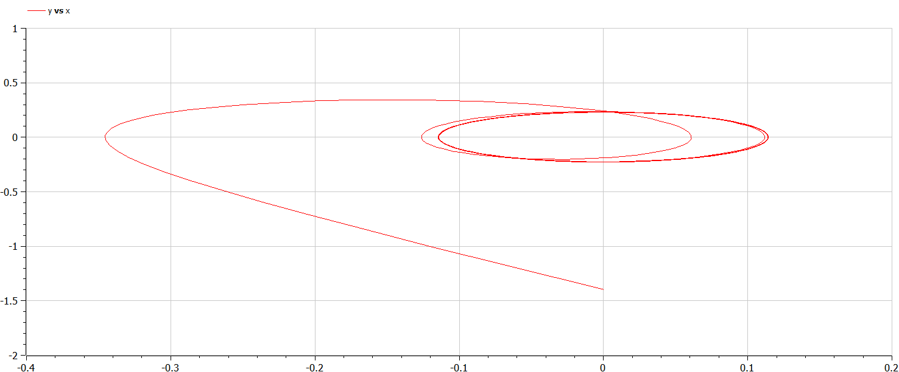

---
## Front matter
lang: ru-RU
title: Лабораторная работа №4
subtitle: Модель гармонических колебаний
author:
  - Белов М.С
institute:
  - Российский университет дружбы народов, Москва, Россия
date: 22 февраля 2024

## i18n babel
babel-lang: russian
babel-otherlangs: english
mainfont: Arial
monofont: Courier New
fontsize: 12pt

## Formatting pdf
toc: false
toc-title: Содержание
slide_level: 2
aspectratio: 169
section-titles: true
theme: metropolis
header-includes:
 - \metroset{progressbar=frametitle,sectionpage=progressbar,numbering=fraction}
 - '\makeatletter'
 - '\beamer@ignorenonframefalse'
 - '\makeatother'
---

# Задача

33 вариант ((1032219262 % 70) + 1)

Постройте фазовый портрет гармонического осциллятора и решение уравнения
гармонического осциллятора для следующих случаев:

1. Колебания гармонического осциллятора без затуханий и без действий внешней
силы $x''+1.7x=0$

2. Колебания гармонического осциллятора c затуханием и без действий внешней
силы $x''+9.8x'+x=0$

3. Колебания гармонического осциллятора c затуханием и под действием внешней
силы $x''+3.9x'+2.9x=0.9cos(2t)$

# Выполнение лабораторной работы

## Моделирование на Julia

- 1. Колебания гармонического осциллятора без затуханий и без действий внешней силы $x''+1.7x=0$

Получившийся график:

## Моделирование на Julia

- 2. Колебания гармонического осциллятора c затуханием и без действий внешней силы $x''+9.8x'+x=0$

Получившийся график:

## Моделирование на Julia

- 3. Колебания гармонического осциллятора c затуханием и под действием внешней силы $x''+3.9x'+2.9x=0.9cos(2t)$

Получившийся график:

## Моделирование на Modelica
- 1. Колебания гармонического осциллятора без затуханий и без действий внешней силы $x''+1.7x=0$

График:

## Моделирование на Modelica

- 2.Колебания гармонического осциллятора c затуханием и без действий внешней силы $x''+9.8x'+x=0$

График:

## Моделирование на Modelica

- 3. Колебания гармонического осциллятора c затуханием и под действием внешней силы $x''+3.9x'+2.9x=0.9cos(2t)$

График:

# Вывод

В ходе работы я построил фазовый портрет гармонического осциллятора и решение уравнения гармонического осциллятора для нескольких случаев
