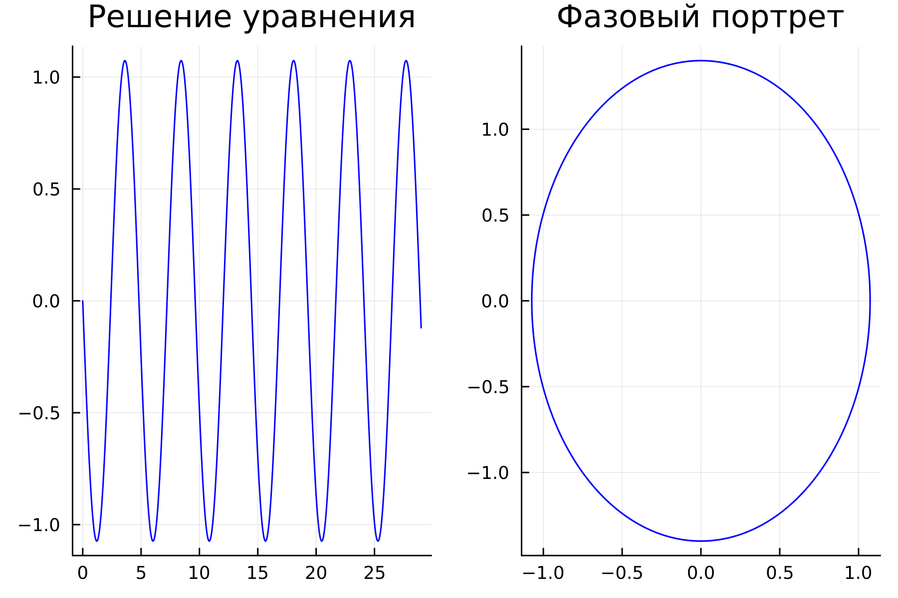
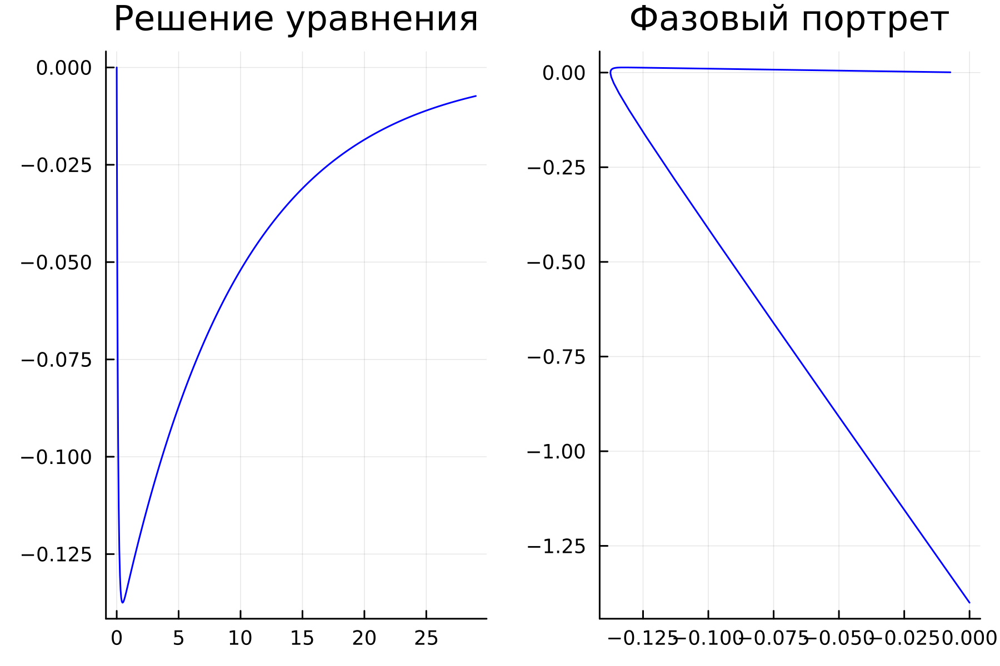
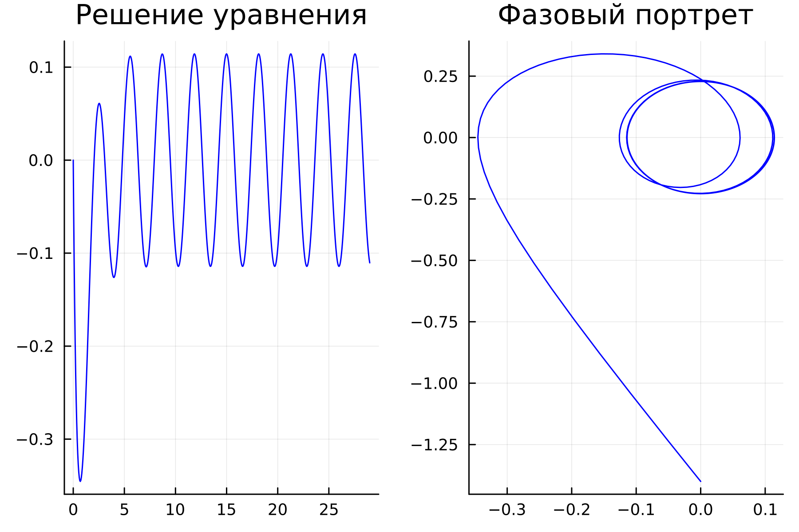
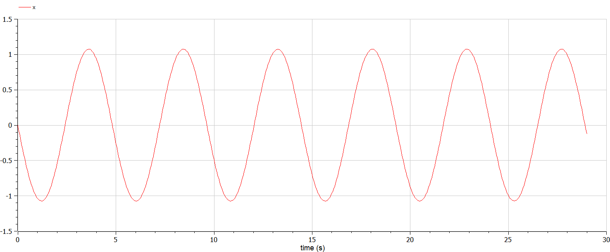
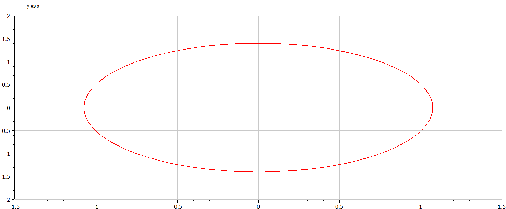
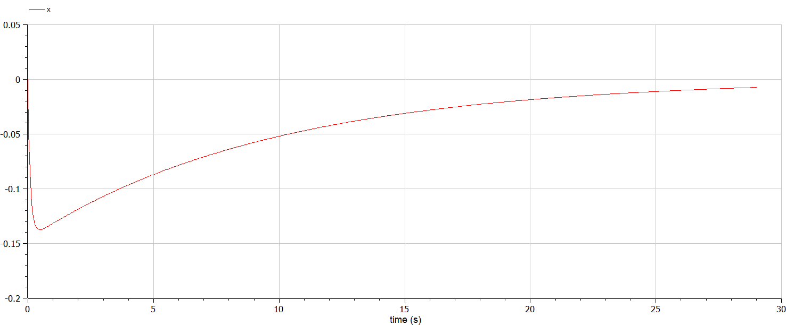
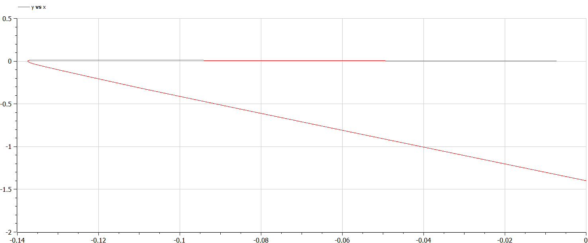
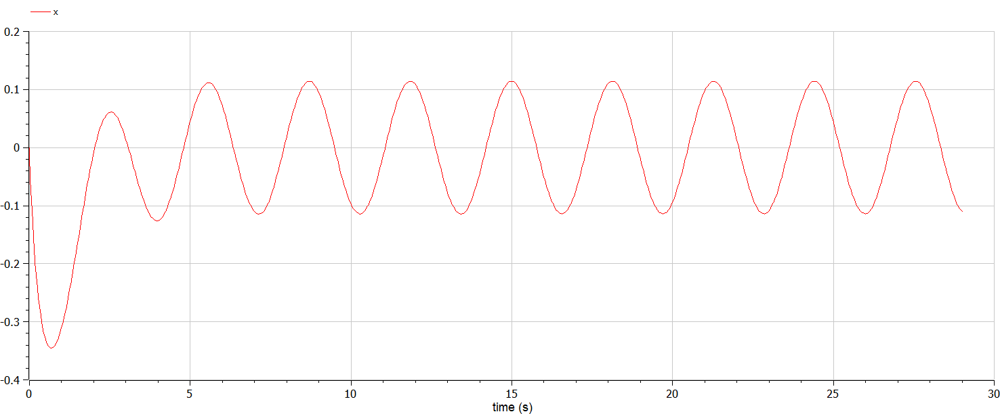
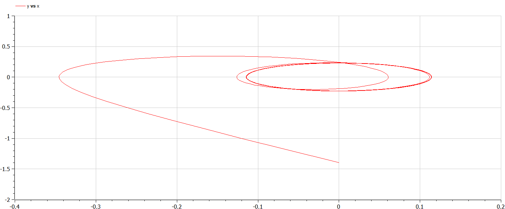

---
## Front matter
title: "Лабораторная работа №4"
subtitle: "Модель гармонических колебаний"
author: "Белов Максим Сергеевич, НПИбд-01-21"

## Generic otions
lang: ru-RU
toc-title: "Содержание"

## Bibliography
bibliography: bib/cite.bib
csl: pandoc/csl/gost-r-7-0-5-2008-numeric.csl

## Pdf output format
toc: true # Table of contents
toc-depth: 2
lof: true # List of figures
fontsize: 12pt
linestretch: 1.5
papersize: a4
documentclass: scrreprt
## I18n polyglossia
polyglossia-lang:
  name: russian
  options:
	- spelling=modern
	- babelshorthands=true
polyglossia-otherlangs:
  name: english
## I18n babel
babel-lang: russian
babel-otherlangs: english
## Fonts
mainfont: PT Serif
romanfont: PT Serif
sansfont: PT Sans
monofont: PT Mono
mainfontoptions: Ligatures=TeX
romanfontoptions: Ligatures=TeX
sansfontoptions: Ligatures=TeX,Scale=MatchLowercase
monofontoptions: Scale=MatchLowercase,Scale=0.9
## Biblatex
biblatex: true
biblio-style: "gost-numeric"
biblatexoptions:
  - parentracker=true
  - backend=biber
  - hyperref=auto
  - language=auto
  - autolang=other*
  - citestyle=gost-numeric

## Pandoc-crossref LaTeX customization
figureTitle: "Рис."
tableTitle: "Таблица"
listingTitle: "Листинг"
lofTitle: "Список иллюстраций"
lotTitle: "Список таблиц"
lolTitle: "Листинги"
## Misc options
indent: true
header-includes:
  - \usepackage{indentfirst}
  - \usepackage{float} # keep figures where there are in the text
  - \floatplacement{figure}{H} # keep figures where there are in the text
---

# Цель работы

Построить фазовый портрет гармонического осциллятора и решение уравнения
гармонического осциллятора для нескольких случаев

# Задание

33 вариант ((1032219262 % 70) + 1)

Постройте фазовый портрет гармонического осциллятора и решение уравнения
гармонического осциллятора для следующих случаев:

1. Колебания гармонического осциллятора без затуханий и без действий внешней
силы $x''+1.7x=0$

2. Колебания гармонического осциллятора c затуханием и без действий внешней
силы $x''+9.8x'+x=0$

3. Колебания гармонического осциллятора c затуханием и под действием внешней
силы $x''+3.9x'+2.9x=0.9cos(2t)$


# Теоретическое введение

## Уравнение свободных колебаний гармонического осциллятора

Уравнение свободных колебаний гармонического осциллятора имеет
следующий вид:
$x''+2gx'+w_0^2x = 0$

# Выполнение лабораторной работы

### Моделирование на Julia

- 1. Колебания гармонического осциллятора без затуханий и без действий внешней силы $x''+1.7x=0$

Исходный код:

``` Julia
using Plots
using DifferentialEquations

w = 1.7
g = 0.0
x0 = 0
y0 = -1.4

function ode_fn(du, u, p, t)
    x, y = u
    du[1] = u[2]
    du[2] = -w*u[1] - g*u[2]
end

v0 = [x0, y0]
tspan = (0.0, 29.0)
prob = ODEProblem(ode_fn, v0, tspan)
sol = solve(prob, dtmax = 0.05)

X = [u[1] for u in sol.u]
Y = [u[2] for u in sol.u]
T = [t for t in sol.t]

plt = plot(
    layout = (1,2),
    dpi = 300,
    legend = false)

plot!(
    plt[1],
    T,
    X,
    title = "Решение уравнения",
    color=:blue)

plot!(
    plt[2],
    X,
    Y,
    title="Фазовый портрет",
    color=:blue)

savefig(plt, "lab4_1.png")
```

Получившийся график:

{ #fig:001 width=70% }


- 2. Колебания гармонического осциллятора c затуханием и без действий внешней силы $x''+9.8x'+x=0$

Исходный код:

``` Julia
using Plots
using DifferentialEquations

w = 1
g = 9.8
x0 = 0
y0 = -1.4

function ode_fn(du, u, p, t)
    x, y = u
    du[1] = u[2]
    du[2] = -w*u[1] - g*u[2]
end

v0 = [x0, y0]
tspan = (0.0, 29.0)
prob = ODEProblem(ode_fn, v0, tspan)
sol = solve(prob, dtmax = 0.05)

X = [u[1] for u in sol.u]
Y = [u[2] for u in sol.u]
T = [t for t in sol.t]

plt = plot(
    layout = (1,2),
    dpi = 300,
    legend = false)

plot!(
    plt[1],
    T,
    X,
    title = "Решение уравнения",
    color=:blue)

plot!(
    plt[2],
    X,
    Y,
    title="Фазовый портрет",
    color=:blue)

savefig(plt, "lab4_2.png")
```
Получившийся график:

{ #fig:002 width=70% }

- 3. Колебания гармонического осциллятора c затуханием и под действием внешней силы $x''+3.9x'+2.9x=0.9cos(2t)$

Исходны код:

```Julia
using Plots
using DifferentialEquations

w = 2.9
g = 3.9
x0 = 0
y0 = -1.4

function ode_fn(du, u, p, t)
    x, y = u
    du[1] = u[2]
    du[2] = -w*u[1] - g*u[2] - 0.9*cos(2*t)
end

v0 = [x0, y0]
tspan = (0.0, 29.0)
prob = ODEProblem(ode_fn, v0, tspan)
sol = solve(prob, dtmax = 0.05)

X = [u[1] for u in sol.u]
Y = [u[2] for u in sol.u]
T = [t for t in sol.t]

plt = plot(
    layout = (1,2),
    dpi = 300,
    legend = false)

plot!(
    plt[1],
    T,
    X,
    title = "Решение уравнения",
    color=:blue)

plot!(
    plt[2],
    X,
    Y,
    title="Фазовый портрет",
    color=:blue)

savefig(plt, "lab4_3.png")
```

Получившийся график:

{ #fig:003 width=70% }


### Моделирование на Modelica
- 1. Колебания гармонического осциллятора без затуханий и без действий внешней силы $x''+1.7x=0$


Исходный код:
```Modelica
model lab4_1
Real x;
Real y;
Real w = 1.7;
Real g = 0.0;
Real t = time;
initial equation
x = 0;
y = -1.4;
equation
der(x) = y;
der(y) = -w*x - g*y;
end lab4_1;
```
График:


{ #fig:004 width=70% }

- 2.Колебания гармонического осциллятора c затуханием и без действий внешней силы $x''+9.8x'+x=0$

Исходный код:

``` OpenModelica
model lab4_2
Real x;
Real y;
Real w = 1.0;
Real g = 9.8;
Real t = time;
initial equation
x = 0;
y = -1.4;
equation
der(x) = y;
der(y) = -w*x - g*y;
end lab4_2;
```
График:


{ #fig:005 width=70% }

- 3. Колебания гармонического осциллятора c затуханием и под действием внешней силы $x''+3.9x'+2.9x=0.9cos(2t)$

Исходный код:

```Modelica
model lab4_3
Real x;
Real y;
Real w = 2.9;
Real g = 3.9;
Real t = time;
initial equation
x = 0;
y = -1.4;
equation
der(x) = y;
der(y) = -w*x - g*y - 0.9*cos(2*time);
end lab4_3;
```

График:


{ #fig:006 width=70% }

# Вывод

В ходе работы я построил фазовый портрет гармонического осциллятора и решение уравнения гармонического осциллятора для нескольких случаев
