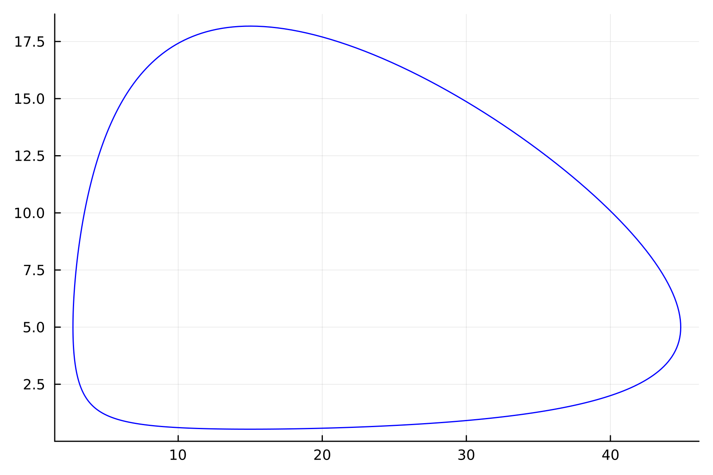
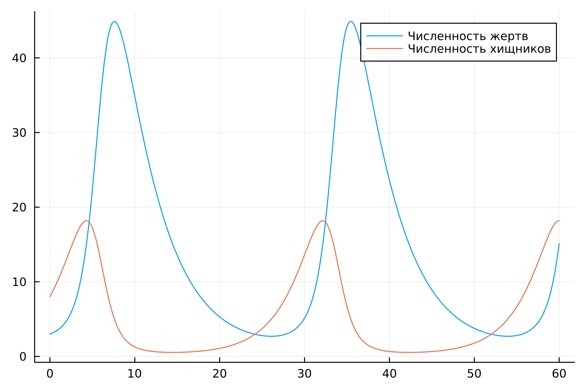
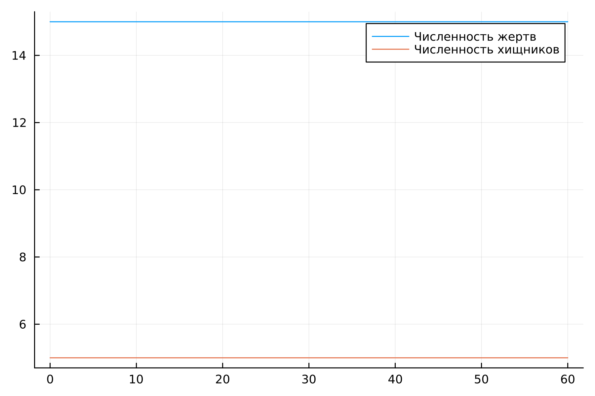
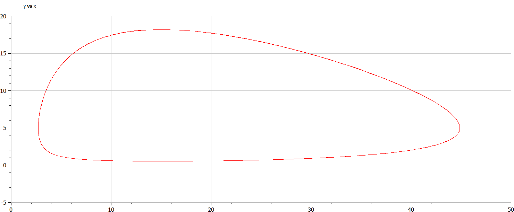
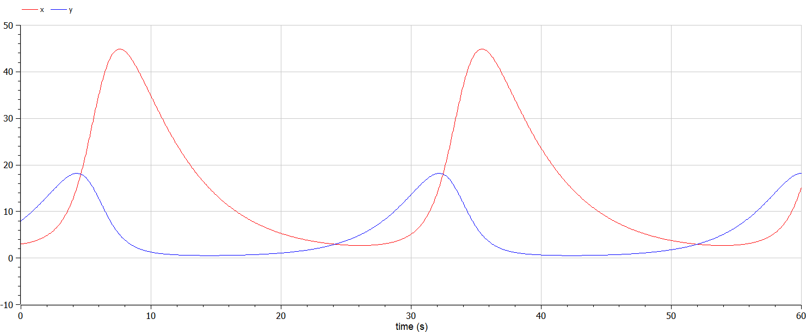
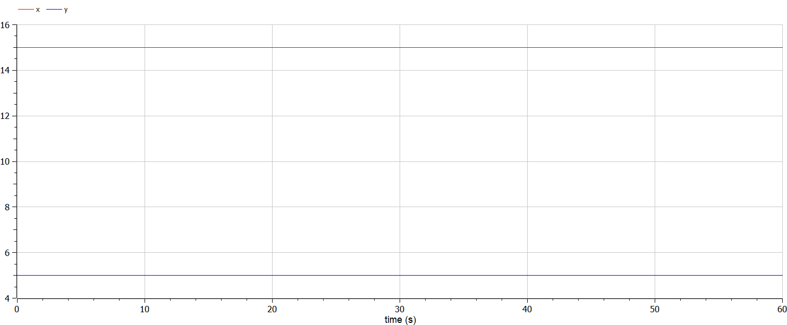

---
## Front matter
lang: ru-RU
title: Лабораторная работа №5
subtitle: Модель хищник-жертва
author:
  - Белов М.С
institute:
  - Российский университет дружбы народов, Москва, Россия
date: 4 марта 2024

## i18n babel
babel-lang: russian
babel-otherlangs: english
mainfont: Arial
monofont: Courier New
fontsize: 12pt

## Formatting pdf
toc: false
toc-title: Содержание
slide_level: 2
aspectratio: 169
section-titles: true
theme: metropolis
header-includes:
 - \metroset{progressbar=frametitle,sectionpage=progressbar,numbering=fraction}
 - '\makeatletter'
 - '\beamer@ignorenonframefalse'
 - '\makeatother'
---

# Задача

33 вариант ((1032219262 % 70) + 1)

Для модели «хищник-жертва»:

$$ \left\{ \begin{array}{cl}
{dx/ dt} = -0.22x(t)+0.044x(t)y(t) \\
{dy/ dt} = 0.33y(t)-0.022x(t)y(t)
\end{array} \right. $$

Постройте график зависимости численности хищников от численности жертв,
а также графики изменения численности хищников и численности жертв при
следующих начальных условиях: $x_0=3, y_0=8$. Найдите стационарное
состояние системы.

# Выполнение лабораторной работы

## Моделирование на Julia

- 1. Построим графики зависимости численности хищников от численности жертв, а также графики изменения численности хищников и численности жертв при следующих начальных условиях: $x_0=3, y_0=8$

## Моделирование на Julia
Получившиеся графики:

## Моделирование на Julia

## Моделирование на Julia

- 2. Найдем стационарное состояние системы. В стационарном случае (положение равновесия, не зависящее от времени решение) будет достигаться в точке $x_0 = c / d$ и $y_0 = a / b$.

## Моделирование на Julia

Получившийся график:

## Моделирование на Modelica
- 1. Реализовав модель на Modelica, получаем аналогичные графики

## Моделирование на Modelica

## Моделирование на Modelica

# Вывод

В ходе работы я построил модель хищник-жертва.