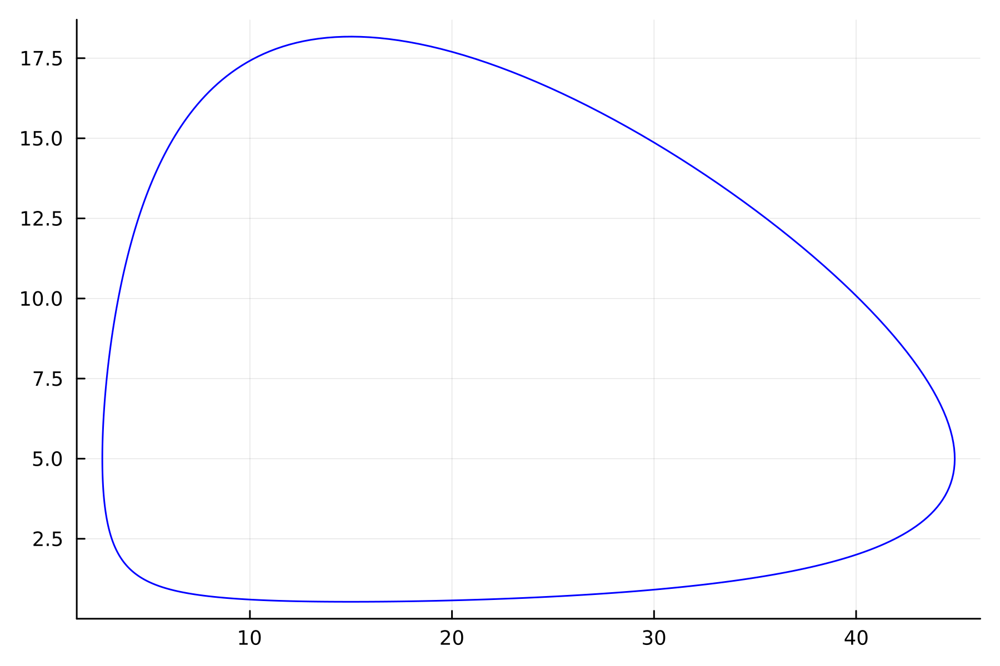
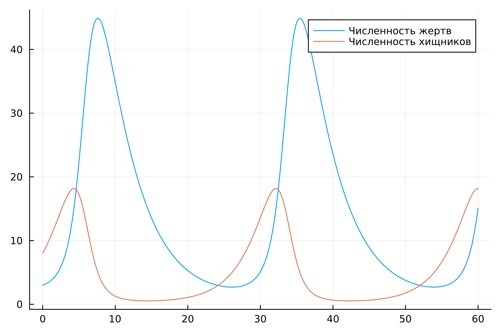
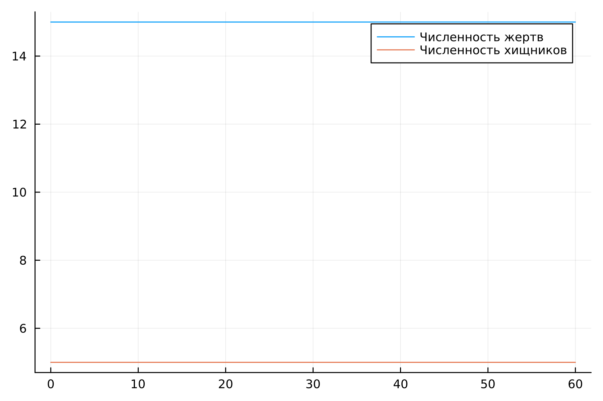
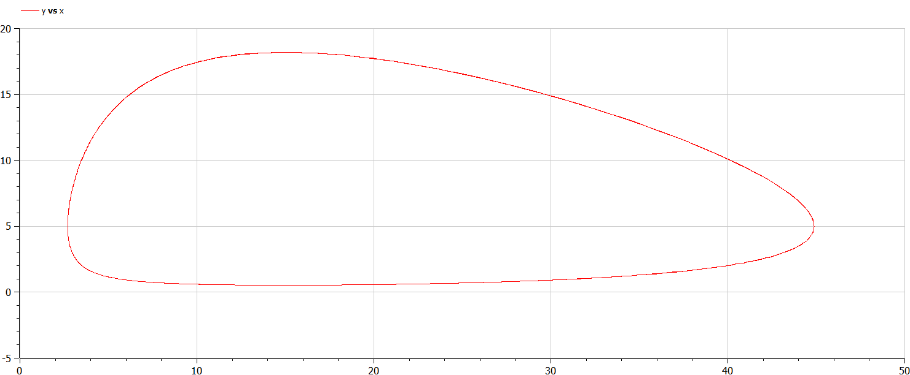
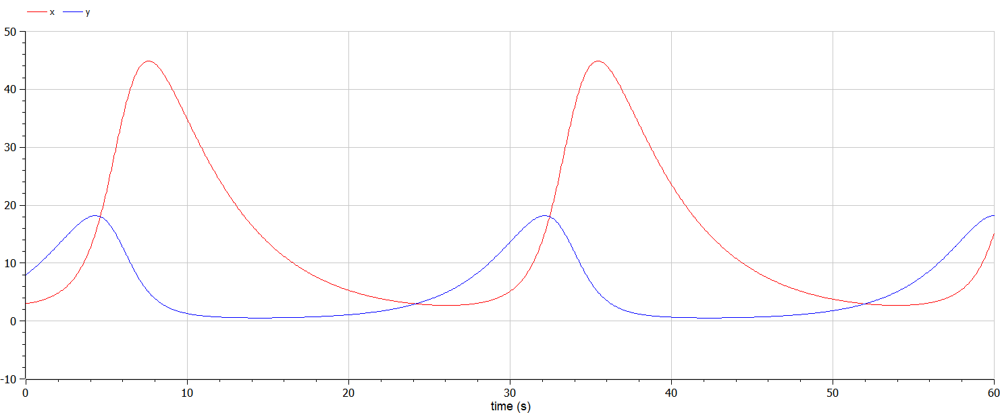
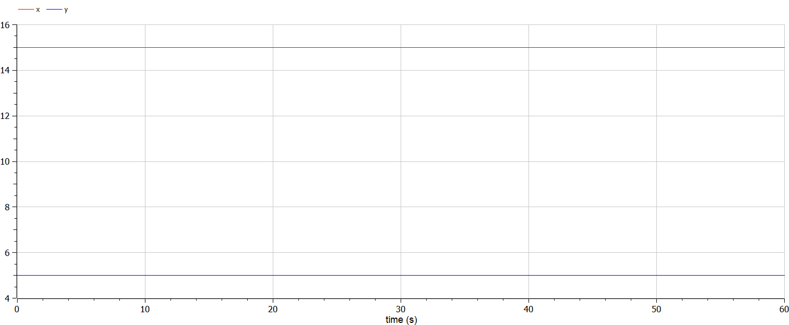

---
## Front matter
title: "Лабораторная работа №5"
subtitle: "Модель хищник-жертва"
author: "Белов Максим Сергеевич, НПИбд-01-21"

## Generic otions
lang: ru-RU
toc-title: "Содержание"

## Bibliography
bibliography: bib/cite.bib
csl: pandoc/csl/gost-r-7-0-5-2008-numeric.csl

## Pdf output format
toc: true # Table of contents
toc-depth: 2
lof: true # List of figures
fontsize: 12pt
linestretch: 1.5
papersize: a4
documentclass: scrreprt
## I18n polyglossia
polyglossia-lang:
  name: russian
  options:
	- spelling=modern
	- babelshorthands=true
polyglossia-otherlangs:
  name: english
## I18n babel
babel-lang: russian
babel-otherlangs: english
## Fonts
mainfont: PT Serif
romanfont: PT Serif
sansfont: PT Sans
monofont: PT Mono
mainfontoptions: Ligatures=TeX
romanfontoptions: Ligatures=TeX
sansfontoptions: Ligatures=TeX,Scale=MatchLowercase
monofontoptions: Scale=MatchLowercase,Scale=0.9
## Biblatex
biblatex: true
biblio-style: "gost-numeric"
biblatexoptions:
  - parentracker=true
  - backend=biber
  - hyperref=auto
  - language=auto
  - autolang=other*
  - citestyle=gost-numeric

## Pandoc-crossref LaTeX customization
figureTitle: "Рис."
tableTitle: "Таблица"
listingTitle: "Листинг"
lofTitle: "Список иллюстраций"
lotTitle: "Список таблиц"
lolTitle: "Листинги"
## Misc options
indent: true
header-includes:
  - \usepackage{indentfirst}
  - \usepackage{float} # keep figures where there are in the text
  - \floatplacement{figure}{H} # keep figures where there are in the text
---

# Цель работы

Построить модель хищник-жертва

# Задание

33 вариант ((1032219262 % 70) + 1)

Для модели «хищник-жертва»:

$$ \left\{ \begin{array}{cl}
{dx/ dt} = -0.22x(t)+0.044x(t)y(t) \\
{dy/ dt} = 0.33y(t)-0.022x(t)y(t)
\end{array} \right. $$

Постройте график зависимости численности хищников от численности жертв,
а также графики изменения численности хищников и численности жертв при
следующих начальных условиях: $x_0=3, y_0=8$. Найдите стационарное
состояние системы.


# Теоретическое введение

## Моде́ль Лотки — Вольтерры

Модель Лотки — Вольтерры (модель Ло́тки — Вольтерра) — модель взаимодействия двух видов типа «хищник — жертва», названная в честь своих авторов (Лотка, 1925; Вольтерра 1926), которые предложили модельные уравнения независимо друг от друга.

Такие уравнения можно использовать для моделирования систем «хищник — жертва», «паразит — хозяин», конкуренции и других видов взаимодействия между двумя видами.

# Выполнение лабораторной работы

### Моделирование на Julia

- 1. Построим графики зависимости численности хищников от численности жертв, а также графики изменения численности хищников и численности жертв при следующих начальных условиях: $x_0=3, y_0=8$


Исходный код:

``` Julia
using Plots
using DifferentialEquations

x0 = 3
y0 = 8

a = 0.22
b = 0.044
c = 0.33
d = 0.022

function ode_fn(du, u, p, t)
    x, y = u
    du[1] = -a*u[1] + b * u[1] * u[2]
    du[2] = c * u[2] - d * u[1] * u[2]
end

v0 = [x0, y0]
tspan = (0.0, 60.0)
prob = ODEProblem(ode_fn, v0, tspan)
sol = solve(prob, dtmax = 0.05)

X = [u[1] for u in sol.u]
Y = [u[2] for u in sol.u]
T = [t for t in sol.t]

plt = plot(
    dpi=300,
    legend=false
)

plot!(
    plt,
    X,
    Y,
    label="Зависимость численности хищников от численности жертв",
    color=:blue
    )

savefig(plt, "lab5_1.png")

plt2 = plot(
    dpi=300,
    legend=true)

plot!(
    plt2,
    T,
    X,
    label="Численность жертв"
)

plot!(
    plt2,
    T,
    Y,
    label="Численность хищников"
)

savefig(plt2, "lab5_2.png")
```

Получившиеся графики:

{ #fig:001 width=70% }

{ #fig:002 width=70% }


- 2. Найдем стационарное состояние системы. В стационарном случае (положение равновесия, не зависящее от времени решение) будет достигаться в точке $x_0 = c / d$ и $y_0 = a / b$.

Исходный код:

``` Julia
using Plots
using DifferentialEquations

a = 0.22
b = 0.044
c = 0.33
d = 0.022

x0 = c/d
y0 = a/b

function ode_fn(du, u, p, t)
    x, y = u
    du[1] = -a*u[1] + b * u[1] * u[2]
    du[2] = c * u[2] - d * u[1] * u[2]
end

v0 = [x0, y0]
tspan = (0.0, 60.0)
prob = ODEProblem(ode_fn, v0, tspan)
sol = solve(prob, dtmax = 0.05)

X = [u[1] for u in sol.u]
Y = [u[2] for u in sol.u]
T = [t for t in sol.t]

plt2 = plot(
    dpi=300,
    legend=true)

plot!(
    plt2,
    T,
    X,
    label="Численность жертв"
)

plot!(
    plt2,
    T,
    Y,
    label="Численность хищников"
)

savefig(plt2, "lab5_3.png")
```
Получившийся график:

{ #fig:003 width=70% }

Как видим, из определения стационарного состояния, график не будет изменяться.


### Моделирование на Modelica
- 1. Построим графики зависимости численности хищников от численности жертв, а также графики изменения численности хищников и численности жертв при следующих начальных условиях: $x_0=3, y_0=8$. Теперь будем использовать Modelica.


Исходный код:
```Modelica
model lab5_1
  Real a = 0.22;
  Real b = 0.044;
  Real c = 0.33;
  Real d = 0.022;
  Real x;
  Real y;
initial equation
  x = 3;
  y = 8;
equation
  der(x) = -a*x + b*x*y;
  der(y) = c*y - d*x*y;
  annotation(experiment(StartTime = 0, StopTime = 60, Tolerance = 1e-6, Interval = 0.05));
end lab5_1;
```
Графики (Modelica):

{ #fig:004 width=70% }
{ #fig:005 width=70% }

- 2. Стационарное состояние

Исходный код:

``` OpenModelica
model lab5_2
  Real a = 0.22;
  Real b = 0.044;
  Real c = 0.33;
  Real d = 0.022;
  Real x;
  Real y;
initial equation
  x = c/d;
  y = a/b;
equation
  der(x) = -a*x + b*x*y;
  der(y) = c*y - d*x*y;
  annotation(experiment(StartTime = 0, StopTime = 60, Tolerance = 1e-6, Interval = 0.05));
end lab5_2;
```
График:

{ #fig:005 width=70% }

Как видно, реализовав модель на Modelica, мы получаем аналогичные графики

# Вывод

В ходе работы я построил модель хищник-жертва.
