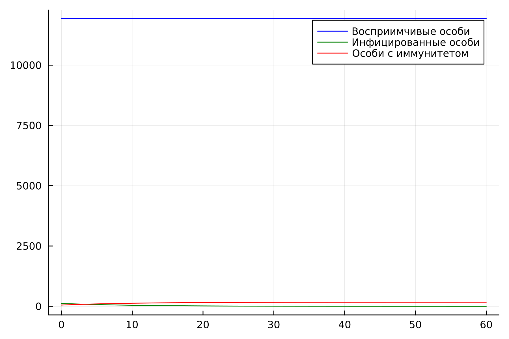
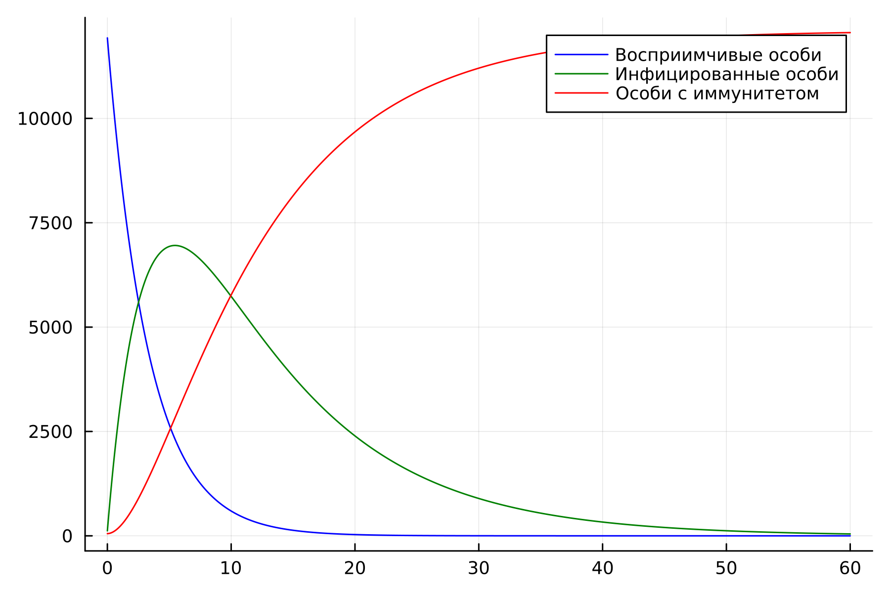
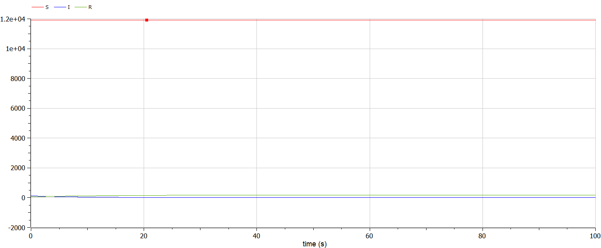
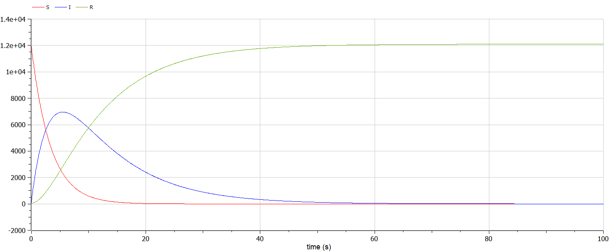

---
## Front matter
lang: ru-RU
title: Лабораторная работа №6
subtitle: Задача об эпидемии
author:
  - Белов М.С
institute:
  - Российский университет дружбы народов, Москва, Россия
date: 12 марта 2024

## i18n babel
babel-lang: russian
babel-otherlangs: english
mainfont: Arial
monofont: Courier New
fontsize: 12pt

## Formatting pdf
toc: false
toc-title: Содержание
slide_level: 2
aspectratio: 169
section-titles: true
theme: metropolis
header-includes:
 - \metroset{progressbar=frametitle,sectionpage=progressbar,numbering=fraction}
 - '\makeatletter'
 - '\beamer@ignorenonframefalse'
 - '\makeatother'
---

# Задача

33 вариант ((1032219262 % 70) + 1)

На одном острове вспыхнула эпидемия. Известно, что из всех проживающих
на острове $(N=12 100)$ в момент начала эпидемии $(t=0)$ число заболевших людей (являющихся распространителями инфекции) $I(0)=120$, А число здоровых людей с иммунитетом к болезни $R(0)=52$. Таким образом, число людей восприимчивых к болезни, но пока здоровых, в начальный момент времени $S(0)=N-I(0)-R(0)$.

Постройте графики изменения числа особей в каждой из трех групп.
Рассмотрите, как будет протекать эпидемия в случае:
1) если $I(0)<=I^*$
2) если $I(0)>I^*$

# Выполнение лабораторной работы

## Моделирование на Julia

- 1. Построим динамику изменения числа людей для каждой из трех групп для первого случая: $I(0)<=I^*$

В качестве коэффициентов $\alpha$ и $\beta$ я выбрал значения $0.3$ и $0.1$ соответственно.

## Моделирование на Julia

## Моделирование на Julia

- 2. Построим динамику изменения числа людей для каждой из трех групп для второго случая: $I(0)>I^*$

## Моделирование на Julia

## Моделирование на Modelica
 Реализовав модель на Modelica, получаем аналогичные графики

## Моделирование на Modelica

## Моделирование на Modelica

# Вывод

В ходе работы я построил модели для задачи об эпидемии.