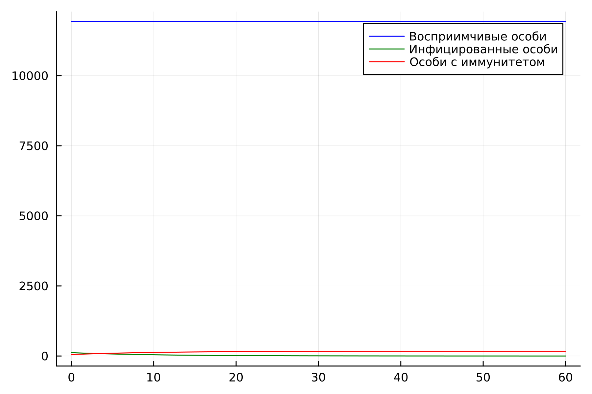
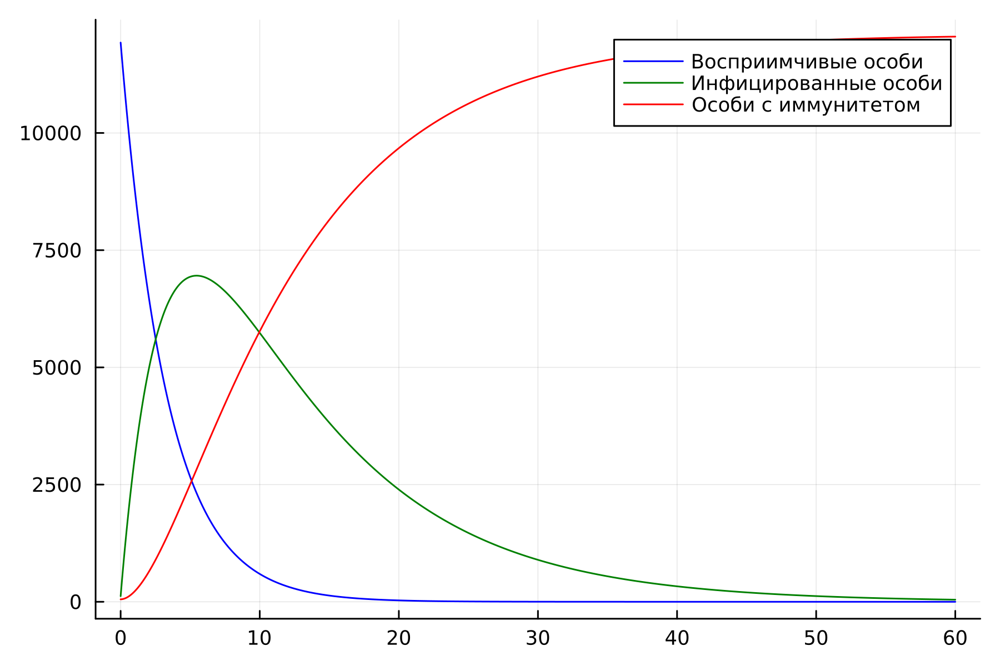
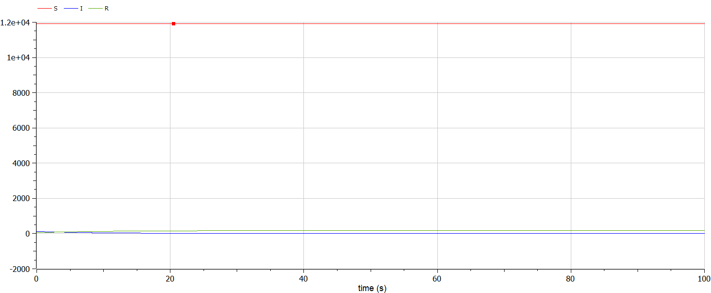
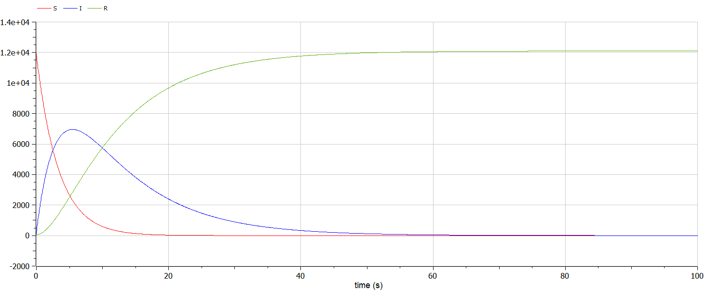

---
## Front matter
title: "Лабораторная работа №6"
subtitle: "Задача об эпидемии"
author: "Белов Максим Сергеевич, НПИбд-01-21"

## Generic otions
lang: ru-RU
toc-title: "Содержание"

## Bibliography
bibliography: bib/cite.bib
csl: pandoc/csl/gost-r-7-0-5-2008-numeric.csl

## Pdf output format
toc: true # Table of contents
toc-depth: 2
lof: true # List of figures
fontsize: 12pt
linestretch: 1.5
papersize: a4
documentclass: scrreprt
## I18n polyglossia
polyglossia-lang:
  name: russian
  options:
	- spelling=modern
	- babelshorthands=true
polyglossia-otherlangs:
  name: english
## I18n babel
babel-lang: russian
babel-otherlangs: english
## Fonts
mainfont: PT Serif
romanfont: PT Serif
sansfont: PT Sans
monofont: PT Mono
mainfontoptions: Ligatures=TeX
romanfontoptions: Ligatures=TeX
sansfontoptions: Ligatures=TeX,Scale=MatchLowercase
monofontoptions: Scale=MatchLowercase,Scale=0.9
## Biblatex
biblatex: true
biblio-style: "gost-numeric"
biblatexoptions:
  - parentracker=true
  - backend=biber
  - hyperref=auto
  - language=auto
  - autolang=other*
  - citestyle=gost-numeric

## Pandoc-crossref LaTeX customization
figureTitle: "Рис."
tableTitle: "Таблица"
listingTitle: "Листинг"
lofTitle: "Список иллюстраций"
lotTitle: "Список таблиц"
lolTitle: "Листинги"
## Misc options
indent: true
header-includes:
  - \usepackage{indentfirst}
  - \usepackage{float} # keep figures where there are in the text
  - \floatplacement{figure}{H} # keep figures where there are in the text
---

# Цель работы

Построить модель для задачи об эпидемии

# Задание

33 вариант ((1032219262 % 70) + 1)

На одном острове вспыхнула эпидемия. Известно, что из всех проживающих
на острове $(N=12 100)$ в момент начала эпидемии $(t=0)$ число заболевших людей (являющихся распространителями инфекции) $I(0)=120$, А число здоровых людей с иммунитетом к болезни $R(0)=52$. Таким образом, число людей восприимчивых к болезни, но пока здоровых, в начальный момент времени $S(0)=N-I(0)-R(0)$.

Постройте графики изменения числа особей в каждой из трех групп.
Рассмотрите, как будет протекать эпидемия в случае:
1) если $I(0)<=I^*$
2) если $I(0)>I^*$


# Теоретическое введение

## Задача об эпидемии

Предположим, что некая популяция, состоящая из N особей, (считаем, что популяция изолирована) подразделяется на три группы. Первая группа - это восприимчивые к болезни, но пока здоровые особи, обозначим их через S(t). Вторая группа – это число инфицированных особей, которые также при этом являются распространителями инфекции, обозначим их I(t). А третья группа, обозначающаяся через R(t) – это здоровые особи с иммунитетом к болезни.

До того, как число заболевших не превышает критического значения $I^*$, считаем, что все больные изолированы и не заражают здоровых. Когда $I(t)>I^*$,тогда инфицирование способны заражать восприимчивых к болезни особей. 


# Выполнение лабораторной работы

### Моделирование на Julia

- 1. Построим динамику изменения числа людей для каждой из трех групп для первого случая: $I(0)<=I^*$

В качестве коэффициентов $\alpha$ и $\beta$ я выбрал значения $0.3$ и $0.1$ соответственно.


Исходный код:

``` Julia
using Plots
using DifferentialEquations

N = 12100
I0 = 120
R0 = 52
S0 = N - I0 - R0
alpha = 0.3
beta = 0.1


function ode_fn(du, u, p, t)
    S, I, R = u
    du[1] = 0
    du[2] = -beta*u[2]
    du[3] = beta*u[2]
end

v0 = [S0, I0, R0]
tspan = (0.0, 60.0)
prob = ODEProblem(ode_fn, v0, tspan)
sol = solve(prob, dtmax = 0.05)
S = [u[1] for u in sol.u]
I = [u[2] for u in sol.u]
R = [u[3] for u in sol.u]
T = [t for t in sol.t]

plt = plot(
    dpi=300,
    legend= :topright
)

plot!(
    plt,
    T,
    S,
    label="Восприимчивые особи",
    color=:blue
)

plot!(
    plt,
    T,
    I,
    label="Инфицированные особи",
    color=:green
)

plot!(
    plt,
    T,
    R,
    label="Особи с иммунитетом",
    color=:red
)

savefig(plt, "lab6_1.png")
```

Получившиеся график:

{ #fig:001 width=70% }

По графику видим, что инфицированные особи изолированы (не заражают восприимчивых) и со временем выздоравливают.

- 2. Построим динамику изменения числа людей для каждой из трех групп для второго случая: $I(0)>I^*$

Исходный код:

``` Julia
using Plots
using DifferentialEquations

N = 12100
I0 = 120
R0 = 52
S0 = N - I0 - R0
alpha = 0.3
beta = 0.1


function ode_fn(du, u, p, t)
    S, I, R = u
    du[1] = -alpha*u[1]
    du[2] = alpha*u[1]-beta*u[2]
    du[3] = beta*u[2]
end

v0 = [S0, I0, R0]
tspan = (0.0, 60.0)
prob = ODEProblem(ode_fn, v0, tspan)
sol = solve(prob, dtmax = 0.05)
S = [u[1] for u in sol.u]
I = [u[2] for u in sol.u]
R = [u[3] for u in sol.u]
T = [t for t in sol.t]

plt = plot(
    dpi=300,
    legend= :topright
)

plot!(
    plt,
    T,
    S,
    label="Восприимчивые особи",
    color=:blue
)

plot!(
    plt,
    T,
    I,
    label="Инфицированные особи",
    color=:green
)

plot!(
    plt,
    T,
    R,
    label="Особи с иммунитетом",
    color=:red
)

savefig(plt, "lab6_2.png")
```
Получившийся график:

{ #fig:002 width=70% }

В этот раз инфицированные особи заражают восприимчивых и со временем выздоравливают (восприимчивые и инфицированные стремятся к 0, а особи с иммунитетом стремятся к N)


### Моделирование на Modelica
- 1. Построи аналогичные графики, используя Modelica
Для первого случая:


Исходный код:
```Modelica
model lab6_1
Real N = 12100;
Real S;
Real I;
Real R;
Real alpha = 0.3;
Real beta = 0.1;
initial equation
I = 120;
R = 52;
S = N - I - R;
equation
der(S) = 0;
der(I) = -beta*I;
der(R) = beta*I;
annotation(
  experiment(StartTime = 0, StopTime = 100, Tolerance = 1e-6, Interval = 0.05));
end lab6_1;
```
График (Modelica):

{ #fig:003 width=70% }

- 2. Для второго случая:

Исходный код:

``` OpenModelica
model lab6_2
Real N = 12100;
Real S;
Real I;
Real R;
Real alpha = 0.3;
Real beta = 0.1;
initial equation
I = 120;
R = 52;
S = N - I - R;
equation
der(S) = -alpha*S;
der(I) = alpha*S - beta*I;
der(R) = beta*I;
annotation(
  experiment(StartTime = 0, StopTime = 100, Tolerance = 1e-6, Interval = 0.05));
end lab6_2;
```
График:

{ #fig:004 width=70% }


# Вывод

В ходе работы я построил модели для задачи об эпидемии
