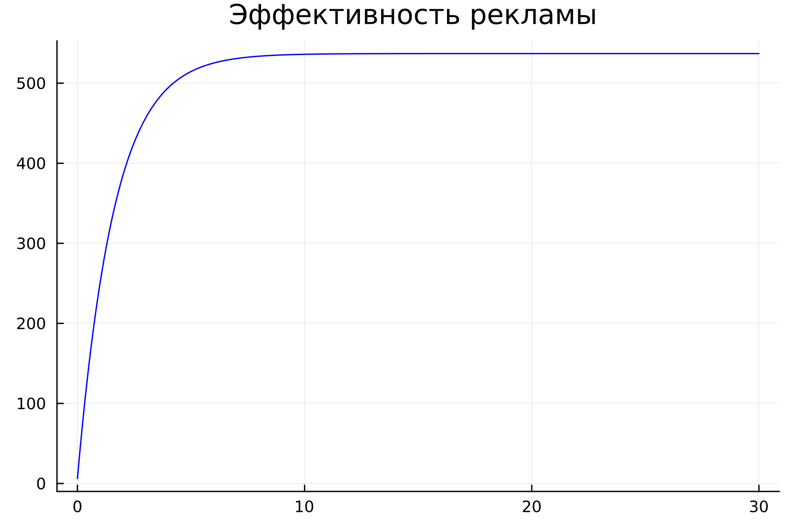
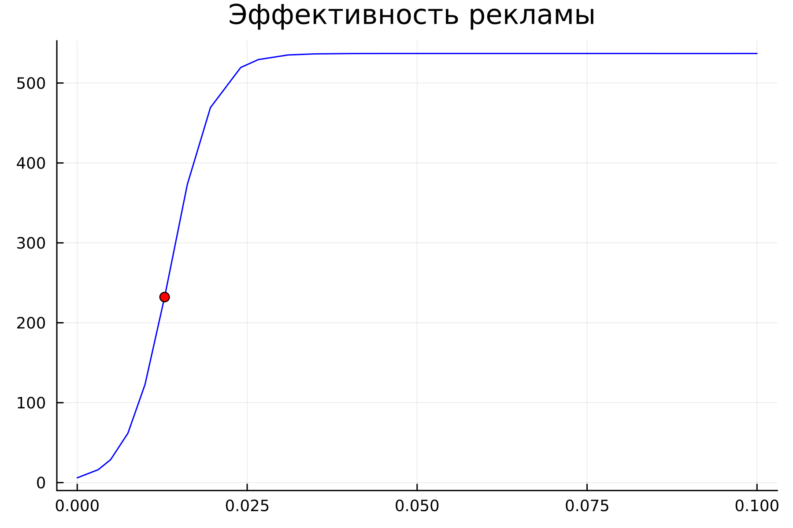
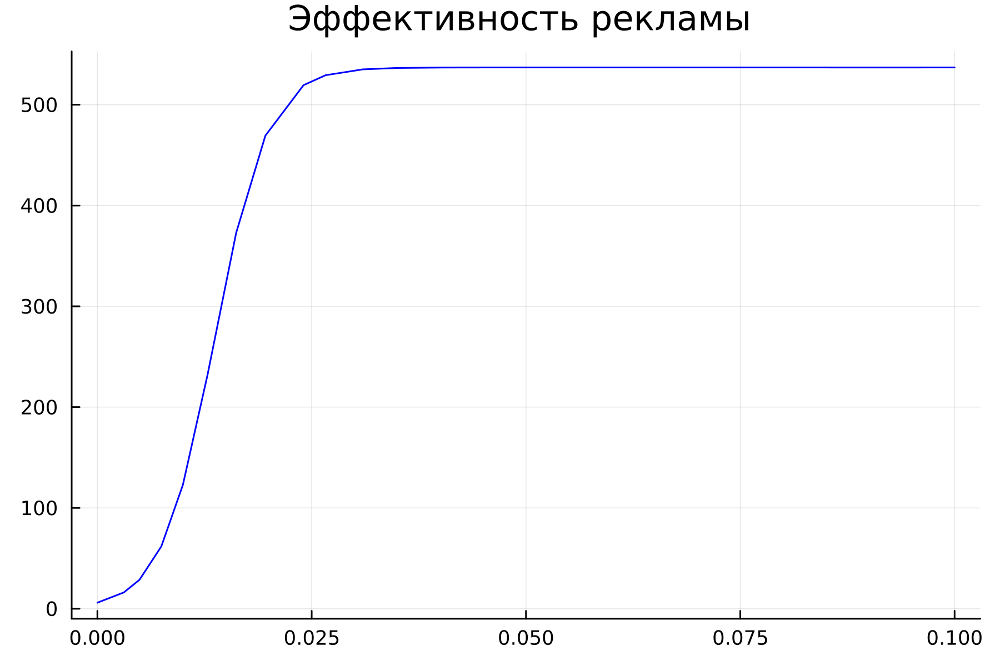
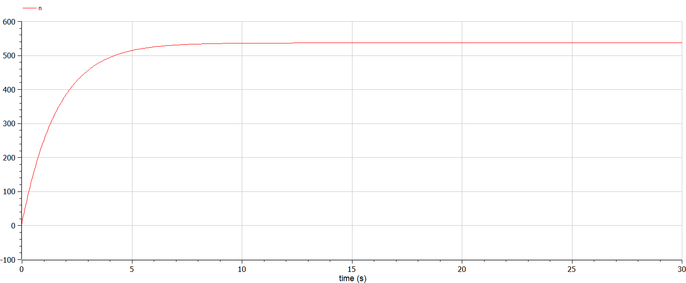
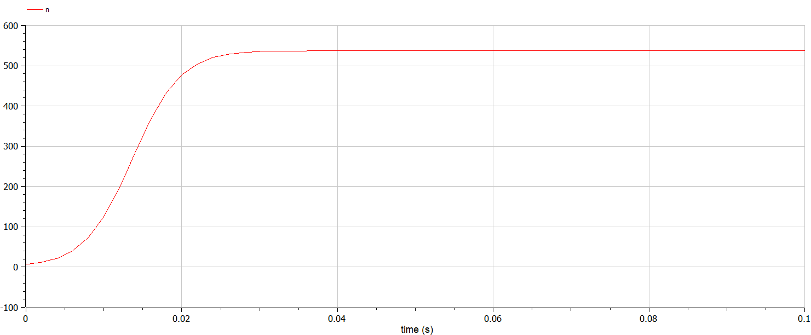
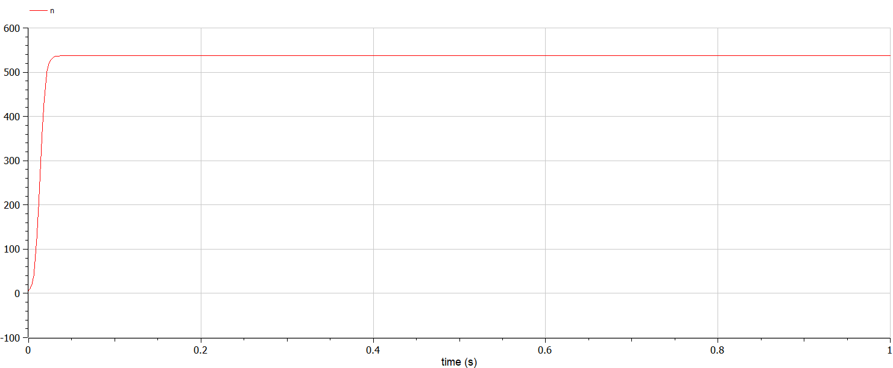

---
## Front matter
lang: ru-RU
title: Лабораторная работа №7
subtitle: Эффективность рекламы
author:
  - Белов М.С
institute:
  - Российский университет дружбы народов, Москва, Россия
date: 18 марта 2024

## i18n babel
babel-lang: russian
babel-otherlangs: english
mainfont: Arial
monofont: Courier New
fontsize: 12pt

## Formatting pdf
toc: false
toc-title: Содержание
slide_level: 2
aspectratio: 169
section-titles: true
theme: metropolis
header-includes:
 - \metroset{progressbar=frametitle,sectionpage=progressbar,numbering=fraction}
 - '\makeatletter'
 - '\beamer@ignorenonframefalse'
 - '\makeatother'
---

# Задача

33 вариант ((1032219262 % 70) + 1)

Постройте график распространения рекламы, математическая модель которой описывается следующим уравнением:

1) $dn/dt = (0.61+0.000061n(t))(N-n(t))$
2) $dn/dt = (0.000061+0.61n(t))(N-n(t))$
3) $dn/dt = (0.61sin(t)+0.61cos(t)n(t))(N-n(t))$

При этом объем аудитории $N = 537$, в начальный момент о товаре знает 6 человек. Для случая 2 определите в какой момент времени скорость распространения рекламы будет иметь максимальное значение.

# Выполнение лабораторной работы

## Моделирование на Julia

- 1. Построим график распространения рекламы, математическая модель которой описывается следующим уравнением:

      $dn/dt = (0.61+0.000061n(t))(N-n(t))$.

## Моделирование на Julia

## Моделирование на Julia

- 2. Построим график распространения рекламы, математическая модель которой описывается следующим уравнением:

      $dn/dt = (0.000061+0.61n(t))(N-n(t))$

А также определим в какой момент времени скорость распространения рекламы будет иметь максимальное значение.

## Моделирование на Julia

## Моделирование на Julia
- 3. Построим график распространения рекламы, математическая модель которой описывается следующим уравнением:

      $dn/dt = (0.61sin(t)+0.61cos(t)n(t))(N-n(t))$
      
## Моделирование на Julia

## Моделирование на Modelica

 Реализовав модель на Modelica, получаем аналогичные графики

## Моделирование на Modelica

## Моделирование на Modelica

## Моделирование на Modelica

# Вывод

В ходе работы я построил графики распространения рекламы для разных случаев