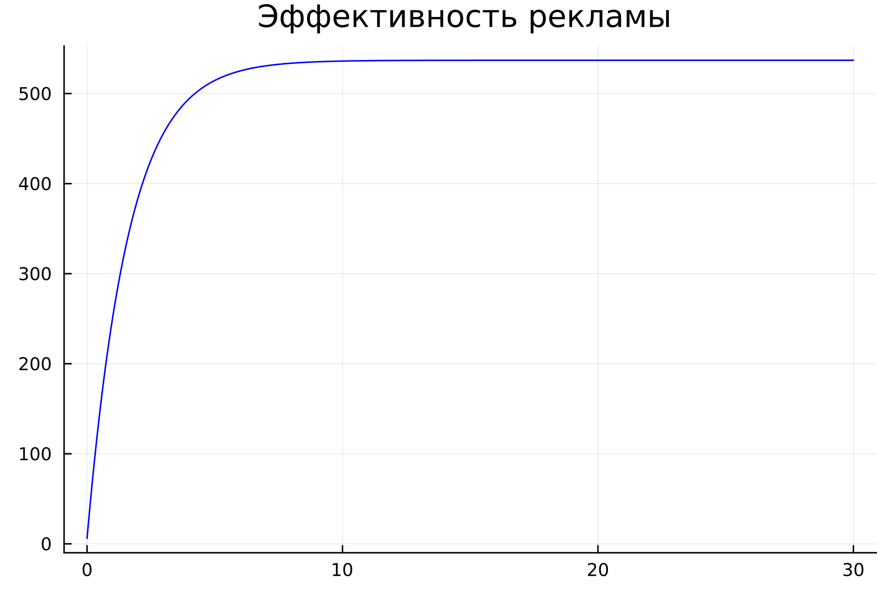
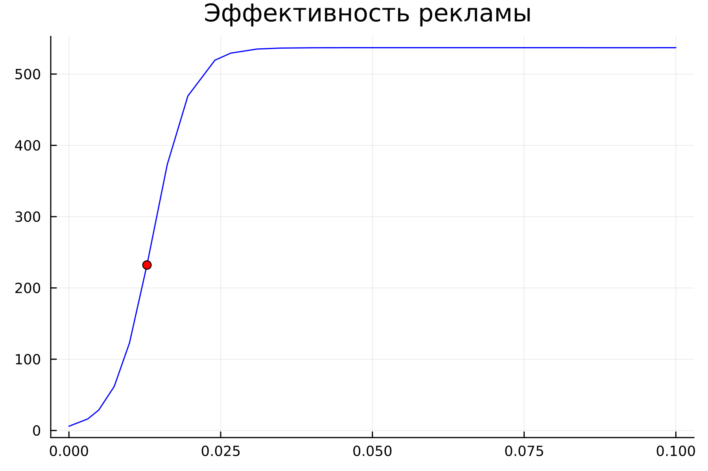
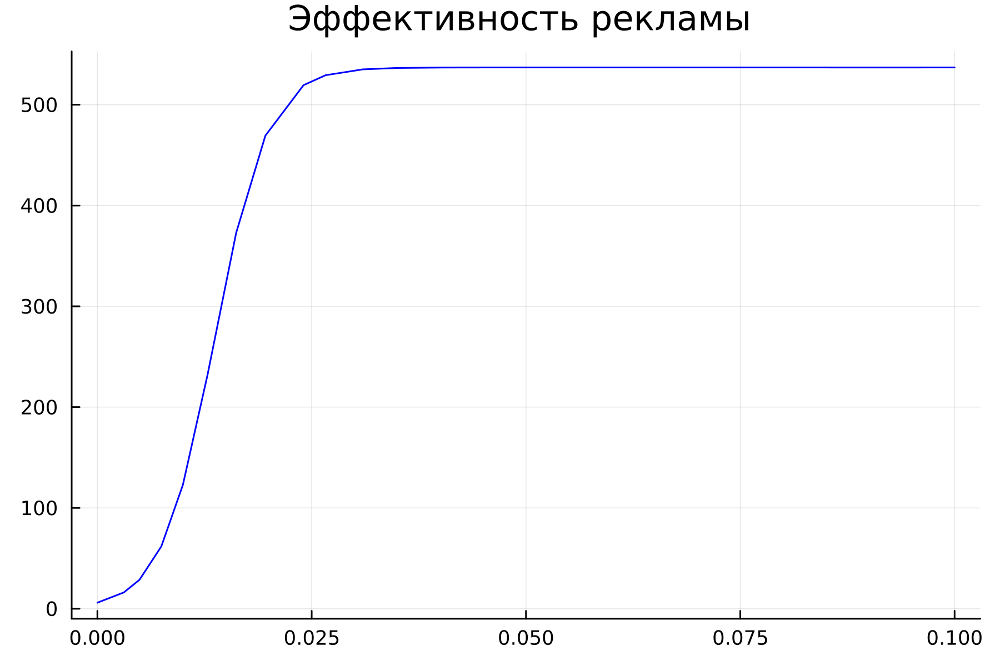
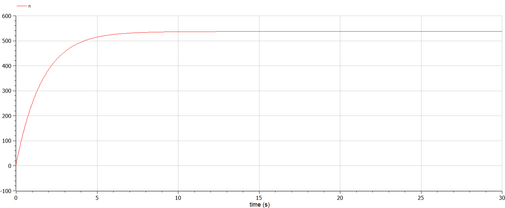
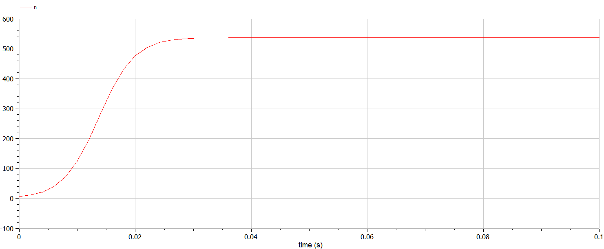
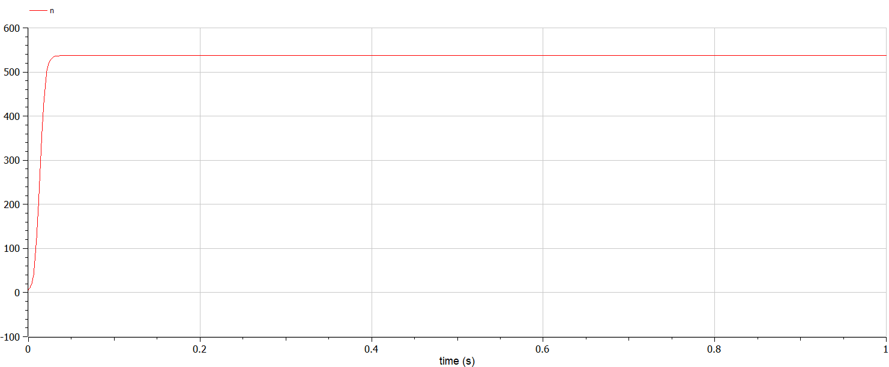

---
## Front matter
title: "Лабораторная работа №7"
subtitle: "Эффективность рекламы"
author: "Белов Максим Сергеевич, НПИбд-01-21"

## Generic otions
lang: ru-RU
toc-title: "Содержание"

## Bibliography
bibliography: bib/cite.bib
csl: pandoc/csl/gost-r-7-0-5-2008-numeric.csl

## Pdf output format
toc: true # Table of contents
toc-depth: 2
lof: true # List of figures
fontsize: 12pt
linestretch: 1.5
papersize: a4
documentclass: scrreprt
## I18n polyglossia
polyglossia-lang:
  name: russian
  options:
	- spelling=modern
	- babelshorthands=true
polyglossia-otherlangs:
  name: english
## I18n babel
babel-lang: russian
babel-otherlangs: english
## Fonts
mainfont: PT Serif
romanfont: PT Serif
sansfont: PT Sans
monofont: PT Mono
mainfontoptions: Ligatures=TeX
romanfontoptions: Ligatures=TeX
sansfontoptions: Ligatures=TeX,Scale=MatchLowercase
monofontoptions: Scale=MatchLowercase,Scale=0.9
## Biblatex
biblatex: true
biblio-style: "gost-numeric"
biblatexoptions:
  - parentracker=true
  - backend=biber
  - hyperref=auto
  - language=auto
  - autolang=other*
  - citestyle=gost-numeric

## Pandoc-crossref LaTeX customization
figureTitle: "Рис."
tableTitle: "Таблица"
listingTitle: "Листинг"
lofTitle: "Список иллюстраций"
lotTitle: "Список таблиц"
lolTitle: "Листинги"
## Misc options
indent: true
header-includes:
  - \usepackage{indentfirst}
  - \usepackage{float} # keep figures where there are in the text
  - \floatplacement{figure}{H} # keep figures where there are in the text
---

# Цель работы

Построить графики распространения рекламы

# Задание

33 вариант ((1032219262 % 70) + 1)

Постройте график распространения рекламы, математическая модель которой описывается следующим уравнением:

1) $dn/dt = (0.61+0.000061n(t))(N-n(t))$
2) $dn/dt = (0.000061+0.61n(t))(N-n(t))$
3) $dn/dt = (0.61sin(t)+0.61cos(t)n(t))(N-n(t))$

При этом объем аудитории $N = 537$, в начальный момент о товаре знает 6 человек. Для случая 2 определите в какой момент времени скорость распространения рекламы будет иметь максимальное значение.

# Теоретическое введение

## Математическая модель

Математическая модель распространения рекламы описывается
уравнением:

$dn/dt = (\alpha_1(t)+\alpha_2(t)n(t))(N-n(t))$

$dn/dt$ - скорость изменения со временем числа потребителей

$n(t)$ - число уже информированных клиентов

$N$ - общее число потенциальных платежеспособных покупателей

$\alpha_1(t)>0$ - характеризует интенсивность рекламной кампании


# Выполнение лабораторной работы

### Моделирование на Julia

- 1. Построим график распространения рекламы, математическая модель которой описывается следующим уравнением:

      $dn/dt = (0.61+0.000061n(t))(N-n(t))$.


Исходный код:

``` Julia
using Plots
using DifferentialEquations

N = 537
n0 = 6

function ode_fn(du, u, p, t)
  (n) = u
  du[1] = (0.61 + 0.000061*u[1])*(N - u[1])
end

v0 = [n0]
tspan = (0.0, 30.0)
prob = ODEProblem(ode_fn, v0, tspan)
sol = solve(prob, dtmax = 0.05)
n = [u[1] for u in sol.u]
T = [t for t in sol.t]

plt = plot(
           dpi = 300,
           title = "Эффективность рекламы ",
           legend = false)
plot!(
      plt,
      T,
      n,
      color = :blue)

savefig(plt, "lab7_1.png")
```

Получившиеся график:

{ #fig:001 width=70% }


- 2. Построим график распространения рекламы, математическая модель которой описывается следующим уравнением:

      $dn/dt = (0.000061+0.61n(t))(N-n(t))$

А также определим в какой момент времени скорость распространения рекламы будет иметь максимальное значение.

Исходный код:

``` Julia
using Plots
using DifferentialEquations

N = 537
n0 = 6

function ode_fn(du, u, p, t)
  (n) = u
  du[1] = (0.000061 + 0.61*u[1])*(N - u[1])
end

v0 = [n0]
tspan = (0.0, 0.1)
prob = ODEProblem(ode_fn, v0, tspan)
sol = solve(prob)
n = [u[1] for u in sol.u]
T = [t for t in sol.t]

max_dn = 0
max_dn_t = 0
max_dn_t = 0

for (i, t) in enumerate(T)
    if sol(t, Val{1})[1] > max_dn
        global max_dn = sol(t, Val{1})[1]
        global max_dn_t = t
        global max_dn_n = n[i]
    end
end

plt = plot(
           dpi = 300,
           title = "Эффективность рекламы ",
           legend = false)
plot!(
      plt,
      T,
      n,
      color = :blue)

plot!(
      plt,
      [max_dn_t],
      [max_dn_n],
      seriestype=:scatter,
      color = :red)

savefig(plt, "lab7_2.png")
```
Получившийся график:

{ #fig:002 width=70% }


- 3. Построим график распространения рекламы, математическая модель которой описывается следующим уравнением:

      $dn/dt = (0.61sin(t)+0.61cos(t)n(t))(N-n(t))$

Исходный код:

``` Julia
using Plots
using DifferentialEquations

N = 537
n0 = 6

function ode_fn(du, u, p, t)
  (n) = u
  du[1] = (0.61*sin(t) + 0.61*cos(t)*u[1])*(N - u[1])
end

v0 = [n0]
tspan = (0.0, 0.1)
prob = ODEProblem(ode_fn, v0, tspan)
sol = solve(prob, dtmax = 0.05)
n = [u[1] for u in sol.u]
T = [t for t in sol.t]

plt = plot(
           dpi = 300,
           title = "Эффективность рекламы ",
           legend = false)
plot!(
      plt,
      T,
      n,
      color = :blue)

savefig(plt, "lab7_3.png")
```
Получившийся график:

{ #fig:003 width=70% }

### Моделирование на Modelica
- 1. Построи аналогичные графики, используя Modelica
Для первого случая:


Исходный код:
```Modelica
model lab7_1
Real N = 537;
Real n;
initial equation
n = 6;
equation
der(n) = (0.61 + 0.000061*n)*(N - n)
annotation(
    experiment(StartTime = 0, StopTime = 30, Tolerance = 1e-6, Interval = 0.05));
end lab7_1;
```
График (Modelica):

{ #fig:004 width=70% }

- 2. Для второго случая:

Исходный код:

``` OpenModelica
model lab7_2
Real N = 537;
Real n;
initial equation
n = 6;
equation
der(n) = (0.000061 + 0.61*n)*(N - n)
annotation(
    experiment(StartTime = 0, StopTime = 0.1, Tolerance = 1e-6, Interval = 0.002));
end lab7_2;
```
График:

{ #fig:005 width=70% }

- 3. Для третьего случая:

Исходный код:

``` OpenModelica
model lab7_3
Real N = 537;
Real n;
initial equation
n = 6;
equation
der(n) = (0.61*sin(time) + 0.61*cos(time)*n)*(N - n)
annotation(
    experiment(StartTime = 0, StopTime = 0.1, Tolerance = 1e-6, Interval = 0.002));
end lab7_3;
```
График:

{ #fig:006 width=70% }


# Вывод

В ходе работы я построил графики распространения рекламы для разных случаев
