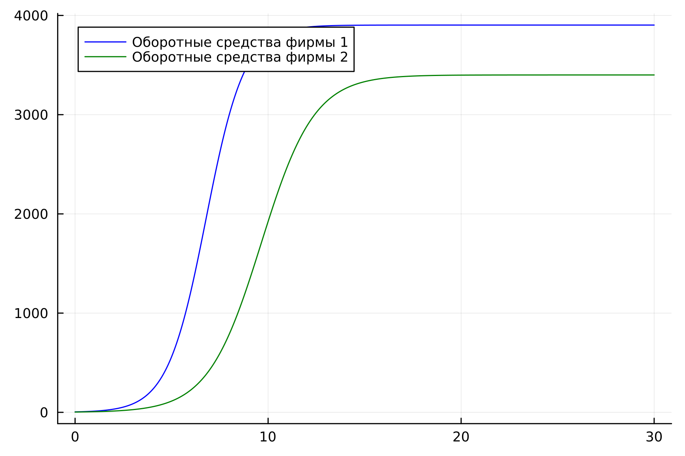
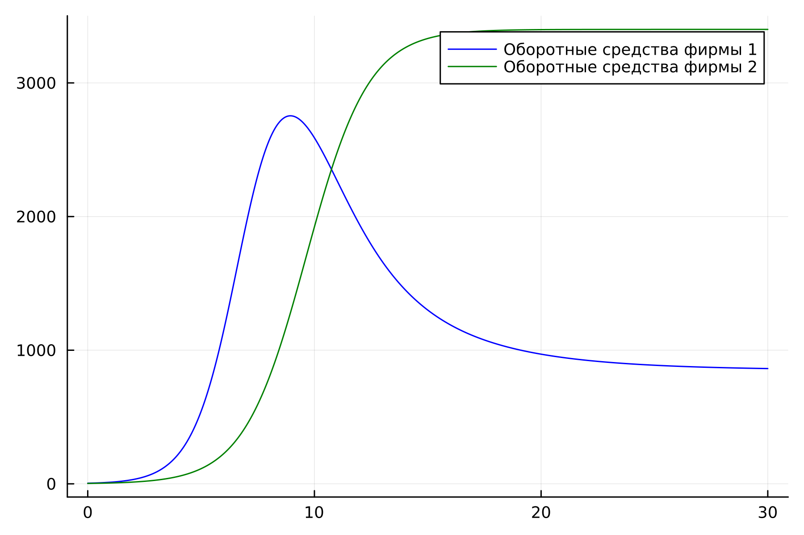
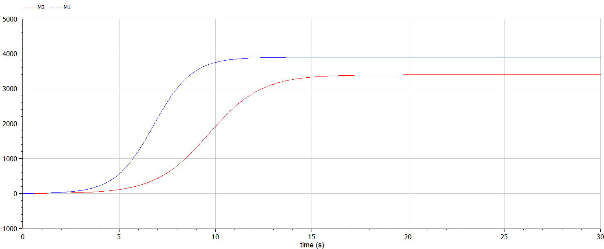
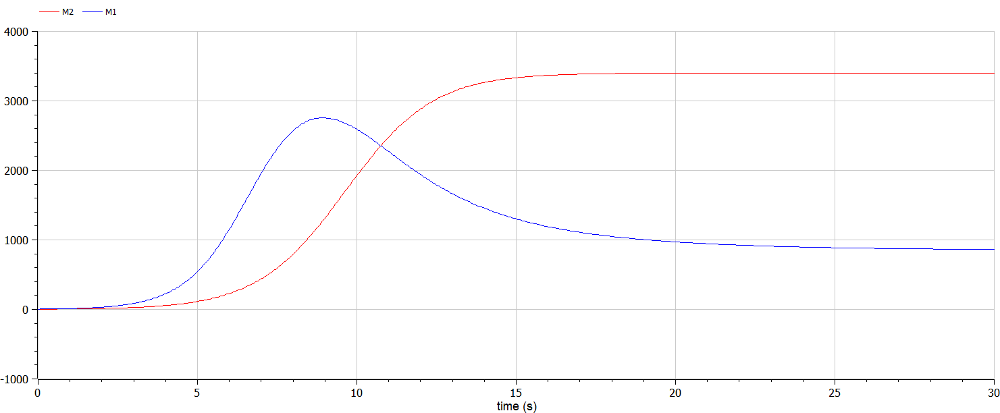

---
## Front matter
lang: ru-RU
title: Лабораторная работа №8
subtitle: Модель конкуренции двух фирм
author:
  - Белов М.С
institute:
  - Российский университет дружбы народов, Москва, Россия
date: 25 марта 2024

## i18n babel
babel-lang: russian
babel-otherlangs: english
mainfont: Arial
monofont: Courier New
fontsize: 12pt

## Formatting pdf
toc: false
toc-title: Содержание
slide_level: 2
aspectratio: 169
section-titles: true
theme: metropolis
header-includes:
 - \metroset{progressbar=frametitle,sectionpage=progressbar,numbering=fraction}
 - '\makeatletter'
 - '\beamer@ignorenonframefalse'
 - '\makeatother'
---

# Задача

33 вариант ((1032219262 % 70) + 1)

1. Постройте графики изменения оборотных средств фирмы 1 и фирмы 2 без
учета постоянных издержек и с веденной нормировкой для случая 1.

2. Постройте графики изменения оборотных средств фирмы 1 и фирмы 2 без
учета постоянных издержек и с веденной нормировкой для случая 2.

Для обоих случаев рассмотрим задачу со следующими начальными условиями и
параметрами:

$M_0^1=4.4, M_0^2=3.1,$ p_cr = 29, $N=35, q=1, \tau_1=21, \tau2=14, p_1=7, p_2=11.5$

# Выполнение лабораторной работы

## Моделирование на Julia

- 1. Построим графики изменения оборотных средств фирмы 1 и фирмы 2 без
учета постоянных издержек и с веденной нормировкой для случая 1.

## Моделирование на Julia

## Моделирование на Julia

- 2. Построим график изменения оборотных средств фирмы 1 и фирмы 2 без
учета постоянных издержек и с веденной нормировкой для случая 2.

## Моделирование на Julia

## Моделирование на Modelica

 Реализовав модель на Modelica, получаем аналогичные графики

## Моделирование на Modelica

## Моделирование на Modelica

# Вывод

В ходе работы я рассмотрел модель конкуренции двух фирм и построил графики изменения их оборотных средств для 2-ух случаев