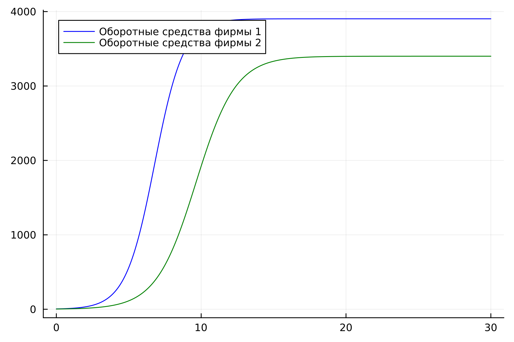
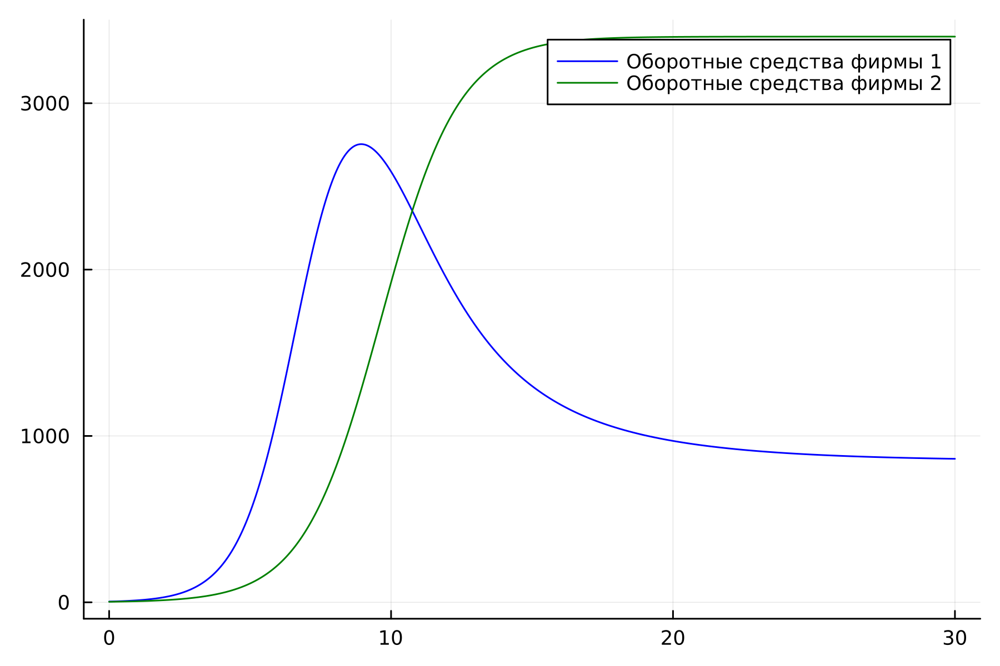
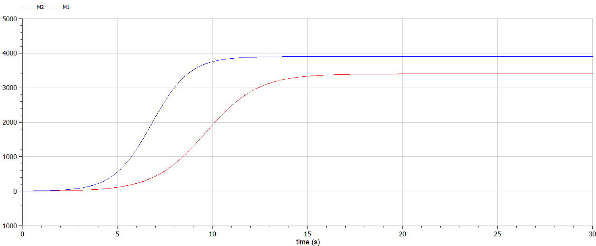
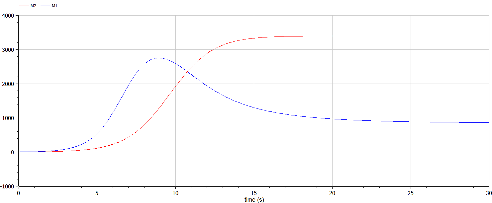

---
## Front matter
title: "Лабораторная работа №8"
subtitle: "Модель конкуренции двух фирм."
author: "Белов Максим Сергеевич, НПИбд-01-21"

## Generic otions
lang: ru-RU
toc-title: "Содержание"

## Bibliography
bibliography: bib/cite.bib
csl: pandoc/csl/gost-r-7-0-5-2008-numeric.csl

## Pdf output format
toc: true # Table of contents
toc-depth: 2
lof: true # List of figures
fontsize: 12pt
linestretch: 1.5
papersize: a4
documentclass: scrreprt
## I18n polyglossia
polyglossia-lang:
  name: russian
  options:
	- spelling=modern
	- babelshorthands=true
polyglossia-otherlangs:
  name: english
## I18n babel
babel-lang: russian
babel-otherlangs: english
## Fonts
mainfont: PT Serif
romanfont: PT Serif
sansfont: PT Sans
monofont: PT Mono
mainfontoptions: Ligatures=TeX
romanfontoptions: Ligatures=TeX
sansfontoptions: Ligatures=TeX,Scale=MatchLowercase
monofontoptions: Scale=MatchLowercase,Scale=0.9
## Biblatex
biblatex: true
biblio-style: "gost-numeric"
biblatexoptions:
  - parentracker=true
  - backend=biber
  - hyperref=auto
  - language=auto
  - autolang=other*
  - citestyle=gost-numeric

## Pandoc-crossref LaTeX customization
figureTitle: "Рис."
tableTitle: "Таблица"
listingTitle: "Листинг"
lofTitle: "Список иллюстраций"
lotTitle: "Список таблиц"
lolTitle: "Листинги"
## Misc options
indent: true
header-includes:
  - \usepackage{indentfirst}
  - \usepackage{float} # keep figures where there are in the text
  - \floatplacement{figure}{H} # keep figures where there are in the text
---

# Цель работы

Рассмотреть модель конкуренции двух фирм

# Задание

33 вариант ((1032219262 % 70) + 1)

1. Постройте графики изменения оборотных средств фирмы 1 и фирмы 2 без
учета постоянных издержек и с веденной нормировкой для случая 1.

2. Постройте графики изменения оборотных средств фирмы 1 и фирмы 2 без
учета постоянных издержек и с веденной нормировкой для случая 2.

Для обоих случаев рассмотрим задачу со следующими начальными условиями и
параметрами:

$M_0^1=4.4, M_0^2=3.1,$ p_cr = 29, $N=35, q=1, \tau_1=21, \tau2=14, p_1=7, p_2=11.5$

# Теоретическое введение

Для построения модели конкуренции хотя бы двух фирм необходимо
рассмотреть модель одной фирмы. Вначале рассмотрим модель фирмы,
производящей продукт долговременного пользования, когда цена его определяется балансом спроса и предложения. Примем, что этот продукт занимает определенную нишу рынка и конкуренты в ней отсутствуют.

Обозначим:
- N – число потребителей производимого продукта.
- S – доходы потребителей данного продукта. Считаем, что доходы всех
потребителей одинаковы. Это предположение справедливо, если речь идет об
одной рыночной нише, т.е. производимый продукт ориентирован на определенный
слой населения.
- M – оборотные средства предприятия
- τ – длительность производственного цикла
- p – рыночная цена товара
- p̃ – себестоимость продукта, то есть переменные издержки на производство
единицы продукции.
- δ – доля оборотных средств, идущая на покрытие переменных издержек.
- κ – постоянные издержки, которые не зависят от количества выпускаемой
продукции.


# Выполнение лабораторной работы

### Моделирование на Julia

- 1. Построим графики изменения оборотных средств фирмы 1 и фирмы 2 без
учета постоянных издержек и с веденной нормировкой для случая 1.


Исходный код:

``` Julia
using Plots
using DifferentialEquations

p_cr = 29
tau1 = 21
p1 = 7  
tau2 = 14
p2 = 11.5
N = 35 
q = 1 

a1 = p_cr / (tau1 * tau1 * p1 * p1 * N * q)
a2 = p_cr / (tau2 * tau2 * p2 * p2 * N *q)
b = p_cr / (tau1 * tau1 * tau2 * tau2 * p1 * p1 * p2 * p2 * N * q)
c1 = (p_cr - p1) / (tau1 * p1)
c2 = (p_cr - p2) / (tau2 * p2)


function ode_fn(du, u, p, t)
  M1, M2 = u
  du[1] = u[1] - b / c1*u[1] * u[2] - a1 / c1*u[1] * u[1]
  du[2] = c2 / c1*u[2] - b / c1*u[1] * u[2] - a2 / c1*u[2] * u[2]
end

v0 = [4.4, 3.1]
tspan = (0.0, 30.0)
prob = ODEProblem(ode_fn, v0, tspan)
sol = solve(prob, dtmax = 0.05)
M1 = [u[1] for u in sol.u]
M2 = [u[2] for u in sol.u]
T = [t for t in sol.t]

plt = plot(
           dpi = 300,
           legend = true)

plot!(
      plt,
      T,
      M1,
      label = "Оборотные средства фирмы 1",
      color = :blue)

plot!(
      plt,
      T,
      M2,
      label = "Оборотные средства фирмы 2",
      color = :green)

savefig(plt, "lab8_1.png")
```

Получившийся график:

{ #fig:001 width=70% }


- 2. Построим график изменения оборотных средств фирмы 1 и фирмы 2 без
учета постоянных издержек и с веденной нормировкой для случая 2.


Исходный код:

``` Julia
using Plots
using DifferentialEquations

p_cr = 29
tau1 = 21
p1 = 7  
tau2 = 14
p2 = 11.5
N = 35 
q = 1 

a1 = p_cr / (tau1 * tau1 * p1 * p1 * N * q)
a2 = p_cr / (tau2 * tau2 * p2 * p2 * N *q)
b = p_cr / (tau1 * tau1 * tau2 * tau2 * p1 * p1 * p2 * p2 * N * q)
c1 = (p_cr - p1) / (tau1 * p1)
c2 = (p_cr - p2) / (tau2 * p2)


function ode_fn(du, u, p, t)
    M1, M2 = u
    du[1] = u[1] - (b / c1 + 0.00023)*u[1] * u[2] - a1 / c1*u[1] * u[1]
    du[2] = c2 / c1*u[2] - b / c1*u[1] * u[2] - a2 / c1*u[2] * u[2]
  end

v0 = [4.4, 3.1]
tspan = (0.0, 30.0)
prob = ODEProblem(ode_fn, v0, tspan)
sol = solve(prob, dtmax = 0.05)
M1 = [u[1] for u in sol.u]
M2 = [u[2] for u in sol.u]
T = [t for t in sol.t]

plt = plot(
           dpi = 300,
           legend = :topright)

plot!(
      plt,
      T,
      M1,
      label = "Оборотные средства фирмы 1",
      color = :blue)

plot!(
      plt,
      T,
      M2,
      label = "Оборотные средства фирмы 2",
      color = :green)

savefig(plt, "lab8_2.png")
```
Получившийся график:

{ #fig:002 width=70% }


### Моделирование на Modelica
- 1. Построи аналогичные графики, используя Modelica

Для первого случая:


Исходный код:
```Modelica
model lab8_1
Real p_cr = 29;
Real tau1 = 21;
Real p1 = 7;
Real tau2 = 14;
Real p2 = 11.5;
Real N = 35;
Real q = 1;

Real a1 = p_cr / (tau1 * tau1 * p1 * p1 * N * q);
Real a2 = p_cr / (tau2 * tau2 * p2 * p2 * N *q);
Real b = p_cr / (tau1 * tau1 * tau2 * tau2 * p1 * p1 * p2 * p2 * N * q);
Real c1 = (p_cr - p1) / (tau1 * p1);
Real c2 = (p_cr - p2) / (tau2 * p2);

Real M1;
Real M2;
initial equation
M1 = 4.4;
M2 = 3.1;
equation
der(M1) = M1 - b / c1*M1 * M2 - a1 / c1*M1 * M1;
der(M2) = c2 / c1*M2 - b / c1*M1 * M2 - a2 / c1*M2 * M2;
annotation(
  experiment(StartTime = 0, StopTime = 30, Tolerance = 1e-6, Interval = 0.05));
end lab8_1;
```
График (Modelica):

{ #fig:003 width=70% }

- 2. Для второго случая:

Исходный код:

``` OpenModelica
model lab8_2
Real p_cr = 29;
Real tau1 = 21;
Real p1 = 7;
Real tau2 = 14;
Real p2 = 11.5;
Real N = 35;
Real q = 1;

Real a1 = p_cr / (tau1 * tau1 * p1 * p1 * N * q);
Real a2 = p_cr / (tau2 * tau2 * p2 * p2 * N *q);
Real b = p_cr / (tau1 * tau1 * tau2 * tau2 * p1 * p1 * p2 * p2 * N * q);
Real c1 = (p_cr - p1) / (tau1 * p1);
Real c2 = (p_cr - p2) / (tau2 * p2);

Real M1;
Real M2;
initial equation
M1 = 4.4;
M2 = 3.1;
equation
der(M1) = M1 - (b / c1 + 0.00023)*M1 * M2 - a1 / c1*M1 * M1;
der(M2) = c2 / c1*M2 - b / c1*M1 * M2 - a2 / c1*M2 * M2;
annotation(
  experiment(StartTime = 0, StopTime = 30, Tolerance = 1e-6, Interval = 0.05));
end lab8_2;
```
График:

{ #fig:004 width=70% }


# Вывод

В ходе работы я рассмотрел модель конкуренции двух фирм и построил графики изменения их оборотных средств для 2-ух случаев
